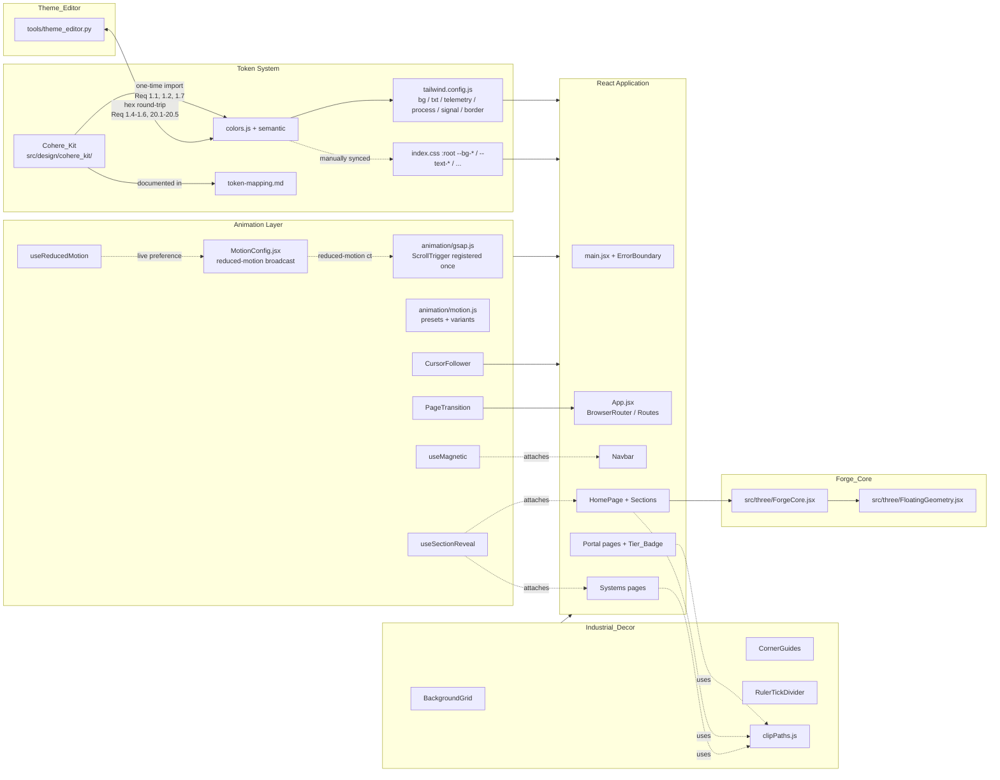

# Design Document

## Overview

This redesign turns Tvastr's currently-dark marketing site and portal into a single Light_Theme industrial surface, layered with a coordinated GSAP + Framer Motion motion system, an explicit Industrial_Decor layer, an updated Forge_Core, and a uniform tier-gating UX in the portal. It is a coordinated change across five tightly coupled subsystems, executed without breaking the existing token contract that the Python Tkinter Theme_Editor already round-trips through `src/design/colors.js`.

The token subsystem keeps the exact shape of `colors` (`background`, `text`, `telemetry`, `process`, `signal`, `border`) and `semantic` (`brand`, `alert`, `danger`) (Req 1.3, 3.4). New light-theme hex values are imported from Cohere_Kit (`npx getdesign@latest add cohere`) into `src/design/cohere_kit/`, and the kit's primary brand token is mapped into `colors.telemetry.primary` (Req 1.1, 1.2). The CSS variables in `src/index.css`, the Tailwind import map in `tailwind.config.js`, and the Theme_Editor regex parser all continue to work unchanged in shape (Req 1.4–1.6, 2.8, 16.5).

The animation subsystem introduces a strict separation of concerns: GSAP (with ScrollTrigger registered exactly once at boot) owns scroll-position-driven and multi-section timelines; Framer Motion owns mount/unmount, layout, gestures, and route transitions (Req 4.2, 4.4–4.6). A single `MotionConfig` at the application root, plus a shared reduced-motion context consumed by GSAP, ensures both layers honor `prefers-reduced-motion: reduce` consistently and within 500 ms of an OS-level preference change (Req 5.1, 5.2, 5.6).

The Industrial_Decor layer extracts the body-level grid currently painted in `src/index.css` into a route-aware `<BackgroundGrid />` component (Req 6.1, 6.7), adds blueprint corner guides on marketing routes (Req 6.2, 6.3), introduces ruler-tick separators for section dividers (Req 6.6, 13.5), and centralizes machined-corner clip paths for every card surface (Req 6.5, 14.6). The Forge_Core adapts to the new background contrast (Req 7.1) while continuing to accent from `semantic.brand` (Req 7.2). And in the portal, a single `Tier_Badge` component renders ACTIVE / INCLUDED / LOCKED states uniformly so the license-tier semantics — already implemented in `src/lib/capabilities.js` — produce a consistent visual contract across `PortalDashboard`, `PortalDownloads`, and `LockedScreen` (Req 15.2–15.10).

The redesign deliberately avoids scope creep: there is no runtime theme switcher, no honoring of `prefers-color-scheme: dark`, no design-token versioning system, and no animation timeline editor (Req 3.1, 3.3). Every visual refinement, micro-interaction, and motion cue is bounded by an explicit performance budget (Reqs 4.7, 17.4, 17.5, 19.1–19.4) and wrapped with reduced-motion guards.

## Architecture

### High-level diagram



### Layered responsibility model

Each layer owns a single concern. The boundaries below are enforced in code review and by lint rules; a single CSS property on a single element must never be written by two layers in the same animation frame (Req 4.6).

- **Token resolution layer** — `src/design/colors.js` + `src/design/cohere_kit/` + `tailwind.config.js` + `src/index.css`. Owns: hex/rgba values, Tailwind utility generation, CSS variable definition. Does not own: any animated value, any DOM mutation, any decoration geometry. Resolves every Tailwind utility used in `src/` to a defined value at build time (Req 16.1, 16.3, 16.4).
- **Decor layer** — `src/components/decor/*` + `src/design/clipPaths.js`. Owns: background grid, corner guides, ruler-tick dividers, machined-corner clip paths. Always rendered behind interactive content with `pointer-events: none` (Req 6.7). Reads tokens; writes nothing else.
- **Scroll/timeline layer (GSAP_Layer)** — `src/animation/gsap.js`, `src/hooks/useSectionReveal.js`. Owns: hero entry timeline, scroll-linked parallax, per-section reveal, FeatureGrid stagger, ambient idle pulse on Forge_Core (Reqs 8.1, 8.2, 9.1, 9.4, 11.6). Registers ScrollTrigger exactly once at boot (Req 4.2). Never drives mount/unmount, never drives gestures (Req 4.4, 4.5).
- **Component motion layer (Motion_Layer)** — `src/animation/motion.js`, `src/animation/MotionConfig.jsx`, `src/components/effects/PageTransition.jsx`, `src/components/effects/CursorFollower.jsx`, `src/hooks/useMagnetic.js`. Owns: page transitions, ProductSlider card transitions, hover/tap state, magnetic CTA, cursor follower (Reqs 10.1, 11.1–11.5, 13.6). Never drives scroll-linked timelines (Req 4.5). Never reads scroll position directly.
- **3D layer (Forge_Core)** — `src/three/ForgeCore.jsx`, `src/three/FloatingGeometry.jsx`. Owns: WebGL render loop, silhouette contrast against the new light background, off-screen pause, context-loss SVG fallback (Req 7.1, 7.5–7.7, 21.5). Pulls accent from `semantic.brand` (Req 7.2).

### Build/runtime data flow

The end-to-end path that a token edit takes from the Theme_Editor into a rendered component:

```mermaid
sequenceDiagram
    participant U as Designer
    participant TE as Theme_Editor (Python)
    participant FS as src/design/colors.js
    participant V as Vite (dev server)
    participant TW as Tailwind 3
    participant CSSV as src/index.css :root
    participant R as React component
    U->>TE: pick new hex for telemetry.primary
    TE->>FS: regex-replace hex value (idempotent)
    Note over FS: byte-identical on second save<br/>(Req 20.1)
    V-->>FS: HMR file watcher triggers
    V->>TW: re-evaluate tailwind.config.js (imports colors.js)
    TW-->>V: regenerate utility classes (bg-bg-primary, text-telemetry-primary, ...)
    Note over CSSV: --telemetry-primary manually synced<br/>(Req 2.8); a build-time check fails<br/>if any token has no matching --* (Req 2.9)
    V->>R: HMR replace module
    R->>R: re-render with new utility / var
    R-->>U: paint with updated color
```

The full cleanup-and-tear-down sequence on route change (when the hero entry timeline is mid-flight and the user navigates to `/technology`) is enumerated in [Hero choreography](#hero-choreography) below; the key invariant is that no scheduled animation callbacks survive a route change (Req 8.4).

## Components and Interfaces

### Token system upgrades

| File                                     | Change                                                                                                                                                                                                                                                                                                       | Requirements            |
| ---------------------------------------- | ------------------------------------------------------------------------------------------------------------------------------------------------------------------------------------------------------------------------------------------------------------------------------------------------------------ | ----------------------- |
| `src/design/colors.js`                   | All hex values replaced in place with light-theme equivalents. **Top-level keys preserved exactly**: `background`, `text`, `telemetry`, `process`, `signal`, `border`, plus `semantic` (`brand`, `alert`, `danger`). Total token count unchanged. Borders remain `rgba()` with alpha-monotonicity preserved. | 1.3, 2.7, 3.4, 16.5     |
| `src/design/cohere_kit/`                 | **NEW**. Output of `npx getdesign@latest add cohere`, committed under one directory. Re-skinned through the existing Tailwind token map; Cohere primitives are imported but their default theme is overridden via the Tailwind extends already in `tailwind.config.js`.                                      | 1.1                     |
| `src/design/cohere_kit/token-mapping.md` | **NEW**. Documents every Cohere_Kit source token, its destination key path in `src/design/colors.js`, and its 6-digit hex value.                                                                                                                                                                             | 1.7                     |
| `tailwind.config.js`                     | Unchanged in shape. The same `bg`, `txt`, `telemetry`, `process`, `signal`, `border` keys are extended; only the underlying values change because they come from the rewritten `colors.js`.                                                                                                                  | 1.6, 16.1               |
| `src/index.css`                          | Replace each `--*` value to match the new `colors.js`. Remove the body-level `linear-gradient` grid (it migrates to `<BackgroundGrid />`). Remove every legacy dark-only utility (`liquid-glass*`, dark scrollbar overrides) so the file contains zero `dark:` references and only Light_Theme values.       | 2.8, 3.2, 3.5, 6.1, 6.7 |

#### Cohere_Kit → Theme_Token mapping (placeholder values)

> The exact hex values come from running `npx getdesign@latest add cohere` once. The values below are placeholders illustrating the shape; the executable mapping file at `src/design/cohere_kit/token-mapping.md` records the canonical values produced by the kit and is committed alongside the token rewrite.

| Cohere_Kit token          | Theme_Token destination                         | Placeholder hex       | Reasoning                                         |
| ------------------------- | ----------------------------------------------- | --------------------- | ------------------------------------------------- |
| `cohere.surface.canvas`   | `colors.background.primary`                     | `#f6f7f9`             | Page background, luminance ≥ 0.85 (Req 2.1)       |
| `cohere.surface.muted`    | `colors.background.secondary`                   | `#eef0f3`             | Subtle section break                              |
| `cohere.surface.elevated` | `colors.background.elevated`                    | `#ffffff`             | Card/raised surface                               |
| `cohere.surface.panel`    | `colors.background.panel`                       | `#e6e9ee`             | Sidebar / heavy panel                             |
| `cohere.text.primary`     | `colors.text.primary`                           | `#0c1116`             | Contrast ≥ 7.0 vs. `background.primary` (Req 2.2) |
| `cohere.text.secondary`   | `colors.text.secondary`                         | `#3b4452`             | Contrast ≥ 4.5 (Req 2.3)                          |
| `cohere.text.muted`       | `colors.text.muted`                             | `#5b6573`             | Contrast ≥ 3.0 large-text only (Req 2.4)          |
| `cohere.brand.primary`    | `colors.telemetry.primary` and `semantic.brand` | `#1f5cff`             | **Brand_Color anchor** (Req 1.2, 7.2)             |
| `cohere.brand.muted`      | `colors.telemetry.secondary`                    | `#1849c9`             | Hover/pressed                                     |
| `cohere.brand.deep`       | `colors.telemetry.muted`                        | `#13388f`             | Subdued accent                                    |
| `cohere.process.primary`  | `colors.process.primary`                        | `#0a8e96`             | Process diagrams (Req 13.2)                       |
| `cohere.process.muted`    | `colors.process.secondary`                      | `#0b7077`             | Process accents                                   |
| `cohere.signal.warning`   | `colors.signal.warning` and `semantic.alert`    | `#b45309`             | Portal accent + alerts (Req 15.2)                 |
| `cohere.signal.glow`      | `colors.signal.glow`                            | `#d97706`             | Emphasis                                          |
| `cohere.signal.danger`    | `colors.signal.danger` and `semantic.danger`    | `#b91c1c`             | Errors only (Req 2.6)                             |
| `cohere.border.subtle`    | `colors.border.subtle`                          | `rgba(15,23,42,0.08)` | α(subtle) (Req 2.7)                               |
| `cohere.border.default`   | `colors.border.default`                         | `rgba(15,23,42,0.16)` | α(default) > α(subtle)                            |
| `cohere.border.strong`    | `colors.border.strong`                          | `rgba(15,23,42,0.28)` | α(strong) > α(default)                            |

A repository-wide guard runs in CI to assert there are no `dark:` Tailwind variants and no theme-switching references anywhere in `src/`; a positive match fails the build with file path and line number (Req 3.2, 3.5).

### Animation infrastructure

All new animation files live under `src/animation/` and `src/hooks/`. Both libraries are pinned to exact versions in `package.json` (no `^` / `~`) and recorded in `pnpm-lock.yaml` so a clean install reproduces the dependency tree (Req 4.1).

- **`src/animation/gsap.js`** — **NEW**. Side-effect module imported once from `main.jsx` (before `<App />` mounts). Exports `gsap` and `ScrollTrigger`, calls `gsap.registerPlugin(ScrollTrigger)` exactly once, guarded by a module-level boolean so HMR cannot re-register it (Req 4.2). Exposes a `gsapContext()` helper for hooks to scope timelines and a single `killAll(scope?)` function used at route change to release timeline + ScrollTrigger references (Req 8.4).
- **`src/animation/motion.js`** — **NEW**. Exports the canonical `easings`, `durations`, and `variants` (see [Animation preset object](#animation-preset-object) below). Both layers import from this module so the GSAP entry timeline (e.g. 1200 ms with `easeOutCubic`) and the Framer Motion fade variants share canonical numbers.
- **`src/animation/MotionConfig.jsx`** — **NEW**. Component wrapping `<MotionConfig>` from `framer-motion` at `App.jsx`'s root, inside `<BrowserRouter>` and outside `<Routes>`. Sets `reducedMotion="user"` (delegating to OS), and broadcasts the resolved boolean through a React context (`<ReducedMotionContext.Provider>`) consumed by both Motion_Layer and GSAP_Layer hooks (Req 5.1, 5.2). Re-evaluates within 500 ms of an OS preference change by listening to the `prefers-reduced-motion` `MediaQueryList`'s `change` event (Req 5.6).
- **`src/hooks/useReducedMotion.js`** — **NEW**. Returns `{ reducedMotion: boolean, detectionFailed: boolean }`. Subscribes to `window.matchMedia('(prefers-reduced-motion: reduce)')`. Evaluated synchronously during the initial render, before the first animation frame (Req 5.7). On detection failure (e.g. `matchMedia` is undefined), returns `reducedMotion: true, detectionFailed: true` (Req 5.8).
- **`src/hooks/useSectionReveal.js`** — **NEW** (replaces the CSS-class-based `src/hooks/useScrollReveal.js`; the old hook is deleted in this feature so reveal logic isn't duplicated). Signature:
  ```ts
  function useSectionReveal(
    ref: React.RefObject<HTMLElement>,
    options?: {
      headingSelector?: string; // default 'h1, h2'
      subheadingSelector?: string; // default '[data-subheading]'
      itemsSelector?: string; // default '[data-reveal-item]' for FeatureGrid
      threshold?: number; // default 0.15 (Req 9.1)
      duration?: number; // ms, default 600 (clamped to 400-900, Req 9.1)
      offset?: number; // px, default 32 (clamped to 16-48, Req 9.1)
      stagger?: number; // ms, default 80 (clamped to 40-120, Req 9.4)
    },
  ): void;
  ```
  Internally creates a single `ScrollTrigger` per section, fires the reveal once, clears inline `transform`/`opacity` 50 ms after completion (Req 9.3), and skips missing elements without erroring (Req 9.5). When `reducedMotion` is true, immediately sets the final state with no animation (Req 9.6). Multiplies durations by 0.7 on viewports between 640 px and 1024 px (Req 18.3).
- **`src/hooks/useMagnetic.js`** — **NEW**. Attaches a Framer Motion `useMotionValue` pair to a target ref. Translates the element toward the cursor, clamped so `max(|dx|, |dy|) ≤ 8 px` (Req 11.1). On pointer-leave, springs back to origin within 250 ms (Req 11.2). No-ops when `(pointer: coarse)` matches or `reducedMotion` is true (Req 11.7, 11.8, 11.9, 18.2).
- **`src/components/effects/CursorFollower.jsx`** — **NEW**. Single `<motion.div>` rendered once near the root (after `<MotionConfig>`). Maximum radius 24 px, visible opacity in `[0.20, 0.35]` (Req 11.3). After 2 s of no `pointermove`, fades over 200–600 ms to opacity 0 (Req 11.4). On next `pointermove`, re-fades within 200 ms (Req 11.5). Returns `null` on `(pointer: coarse)` or viewport < 640 px or `reducedMotion` (Req 11.7, 18.2, 11.9).
- **`src/components/effects/PageTransition.jsx`** — **NEW**. Wraps `<Routes>` in `App.jsx` with `<AnimatePresence mode="wait">` and a `<motion.div>` keyed by `location.pathname`. Uses the canonical `pageEnter`/`pageExit` variants (200–500 ms combined, Req 10.1). Exposes a 1000 ms watchdog that snaps to the destination's final state and emits a single `console.warn` if the transition exceeds the budget (Req 10.4). Cancels the in-flight variant within 50 ms of a new route change (Req 10.3).

### Industrial decor layer

All decor components are in `src/components/decor/` (NEW directory) and have `pointer-events: none` set on their root so clicks pass through (Req 6.7).

- **`src/components/decor/BackgroundGrid.jsx`** — **NEW**. Renders the fixed full-viewport grid that currently lives in `src/index.css` `body` rule. 1-pixel lines, 32 px spacing on both axes, color from `colors.border.subtle` (Req 6.1). Mounted once near the application root so it persists across routes; the `body` `background-image` declaration in `index.css` is removed during the same change.
- **`src/components/decor/CornerGuides.jsx`** — **NEW**. Renders four absolutely-positioned SVG corner brackets at the viewport corners. Each guide is two perpendicular line segments 24–48 px long, offset 12–24 px from the edge, 1 px stroke from `colors.border.default` (Req 6.2). Reads the current pathname via `useLocation`; renders only when the path matches `/`, `/technology`, `/about`, `/research` (Req 6.3) or matches a system detail page on viewports > 1024 px (Req 14.2, 14.3, 18.1). At viewports < 640 px it renders at exactly 50 % of the desktop stroke length (Req 18.1).
- **`src/components/decor/RulerTickDivider.jsx`** — **NEW**. Renders a horizontal divider as a sequence of ruler-tick marks, each 4–8 px long, spaced 8–16 px apart, in `colors.border.default` (Req 6.6). Used between architectural zones in `DeploymentSection` (Req 13.5) and as a section divider primitive available to any section.
- **`src/design/clipPaths.js`** — **NEW** utility. Exports:
  ```ts
  export function machinedCorner(
    size: number,
    corners?: ("tl" | "tr" | "bl" | "br")[],
  ): string;
  export const cardClipPath: string; // default for ProductCard family
  export const tileClipPath: string; // SystemImpactGrid tiles
  ```
  Returns CSS `clip-path: polygon(...)` strings producing chamfered notches 8–16 px (cards, Req 6.5) or 8–24 px (impact tiles, Req 14.6) on at least one corner.

#### Component changes that consume the decor layer

| Component                                                                                           | Visible change                                                                                                                                                                                                                                                                                       | Requirements          |
| --------------------------------------------------------------------------------------------------- | ---------------------------------------------------------------------------------------------------------------------------------------------------------------------------------------------------------------------------------------------------------------------------------------------------- | --------------------- |
| `src/components/navigation/Navbar.jsx`                                                              | Transparent under 16 px scroll, surfaces with `colors.background.primary` α 0.85–0.95 + 1 px `colors.border.subtle` bottom border above 16 px; transition 150–300 ms (animated by Motion_Layer); active link colored `colors.telemetry.primary`. Snap (no transition) when reduced-motion is active. | 12.1–12.6             |
| `src/components/ProductCard.jsx`                                                                    | Light-theme background, machined-corner clip on top-right corner via `clipPaths.cardClipPath`; defect grid colors retargeted to `colors.signal.warning` & `colors.background.primary`.                                                                                                               | 6.5, 13.1, 13.7, 13.8 |
| `src/components/LockedProductCard.jsx`                                                              | Machined-corner clip; LOCKED Tier_Badge; upgrade CTA accent from `colors.signal.warning`.                                                                                                                                                                                                            | 6.5, 15.4             |
| `src/components/ProductDownloadCard.jsx`                                                            | Machined-corner clip; light-theme surfaces; checksum readout uses monospace face.                                                                                                                                                                                                                    | 6.4, 6.5              |
| `src/components/RollbackVersionCard.jsx`                                                            | Machined-corner clip; version string in monospace; light-theme.                                                                                                                                                                                                                                      | 6.4, 6.5              |
| `src/components/UpgradeBanner.jsx`                                                                  | Machined-corner clip on at least one corner; hidden entirely for `full_stack` tier (Req 15.8); shown for unrecognized/undefined tier (Req 15.10).                                                                                                                                                    | 6.5, 15.8, 15.10      |
| `src/components/sections/home/IndustrialMemorySection.jsx` (and the home equivalent of "Ecosystem") | Flow-diagram strokes from `colors.process.primary`; node fills from `colors.background.primary`.                                                                                                                                                                                                     | 13.1, 13.2, 13.3      |
| `src/components/sections/DeploymentSection.jsx`                                                     | On-premise diagram strokes from `colors.telemetry.primary`; ruler-tick separators between architectural zones via `RulerTickDivider`.                                                                                                                                                                | 13.4, 13.5            |
| `src/components/sections/ContactSection.jsx`                                                        | Light-theme; founder email/LinkedIn link gain a `colors.telemetry.primary` underline on focus-visible.                                                                                                                                                                                               | 13.1, 13.9            |
| `src/components/systems/SystemWorkflow.jsx`                                                         | Connector lines `colors.border.strong`, stroke width 1–3 px; node labels `colors.text.primary`.                                                                                                                                                                                                      | 14.5                  |
| `src/components/systems/SystemImpactGrid.jsx`                                                       | Each tile gets a machined-corner clip 8–24 px; empty-data state shows an empty-state indicator and renders no tiles.                                                                                                                                                                                 | 14.6, 14.7            |
| `src/components/LockedScreen.jsx`                                                                   | Lock icon + product name title + minimum-tier message + upgrade CTA, all colors from Theme_Tokens.                                                                                                                                                                                                   | 15.9                  |
| `src/pages/PortalLogin.jsx`, `src/pages/PortalDashboard.jsx`, `src/pages/PortalDownloads.jsx`       | Light-theme; root background `colors.background.primary`; body `colors.text.primary`; metadata `colors.text.muted`.                                                                                                                                                                                  | 15.1                  |

### Forge_Core adaptation

The Forge_Core lives at `src/three/ForgeCore.jsx` (with `src/three/FloatingGeometry.jsx` for ambient particles), as documented in the project README. Modifications:

- **Silhouette contrast** — Material/light setup adjusted so any sampled silhouette edge pixel maintains a Contrast_Ratio ≥ 1.4 against `colors.background.primary` at every rendered frame on the new light background (Req 7.1). Achieved by shifting the icosahedron's diffuse material toward a darker neutral and tightening the rim light.
- **Brand accent** — The emissive accent reads from `semantic.brand` (which is the same value as `colors.telemetry.primary`, Req 1.2, 7.2).
- **Mobile pixel-ratio cap** — When `window.innerWidth < 768` the renderer's pixel ratio is clamped to 1.5 (Req 7.3).
- **Off-screen pause** — An `IntersectionObserver` on the hero section's bounding rectangle pauses the render loop when the rectangle is fully outside the viewport (Req 7.5) and resumes it within 200 ms when it re-enters (Req 7.6).
- **Idle pulse** — When no `pointermove`, `scroll`, `keydown`, or `touchstart` event has occurred for 8 s, the GSAP_Layer drives an ambient idle pulse with scale ∈ [0.98, 1.02] and period ∈ [2 s, 4 s] (Req 11.6). Suppressed when `reducedMotion` is true (Req 11.9).
- **Reduced-motion final pose** — When `reducedMotion` is true, render a single deterministic final-pose frame and skip the rotation animation (Req 5.4).
- **WebGL context-loss SVG fallback** — A `webglcontextlost` listener on the canvas swaps the canvas for a static `<svg>` whose accent color is `semantic.brand`, preserving the original layout box; one `console.warn` per page load (Req 7.7, 21.5).

### Hero choreography

GSAP timeline structure for the hero on mount, with named labels so the cleanup path is unambiguous:

```ts
// Inside HeroSection.jsx, run only at mount
const tl = gsap.timeline({
  defaults: { ease: easings.standard },
  paused: reducedMotion, // pause + jumpToEnd if reduced-motion (Req 8.5)
});
tl.addLabel("wordmark", 0)
  .from(wordmarkRef.current, { opacity: 0, y: 24, duration: 0.6 }, "wordmark")
  .addLabel("tagline", "+=0.05")
  .from(taglineRef.current, { opacity: 0, y: 16, duration: 0.5 }, "tagline")
  .addLabel("cta", "+=0.05")
  .from(ctaRef.current, { opacity: 0, y: 12, duration: 0.4 }, "cta")
  .addLabel("forge", "+=0.05")
  .from(forgeRef.current, { opacity: 0, scale: 0.95, duration: 0.5 }, "forge");
// total duration ≈ 1.2 s, within the 800-1600 ms window (Req 8.1)
```

In parallel:

- A separate ScrollTrigger drives a parallax that maps scroll progress in `[0, 1]` to vertical translation on the Forge_Core wrapper in `[0, 120]` px, monotonically and updated within 16 ms of each scroll event (Req 8.2).
- The Navbar links and CTA button retain their event handlers throughout the entry timeline; nothing in the timeline interferes with `tabIndex`, focus traversal, or click latency (Req 8.3, 17.1, 17.2).

Mount + scroll + route-exit sequence:

1. Component mounts → `gsap.context(() => { ... }, heroRef)` is created.
2. ScrollTrigger plugin is already registered (Req 4.2); a new `ScrollTrigger.create({ scrub: true })` attaches the parallax.
3. Entry timeline plays.
4. User scrolls → parallax updates within 16 ms per scroll event.
5. User navigates to `/technology` → the route change propagates to `App.jsx`.
6. `useEffect` cleanup on `HeroSection` calls `ctx.revert()` and `ScrollTrigger.getAll().filter(t => t.scope === heroRef).forEach(t => t.kill())`.
7. All timeline + ScrollTrigger references are released before the next page mounts (Req 8.4).

### Page transition shell

`App.jsx` wires `PageTransition` between `<BrowserRouter>` and `<Routes>`:

```jsx
<BrowserRouter>
  <AuthProvider>
    <LicenseProvider>
      <MotionConfig>
        <BackgroundGrid />
        <CornerGuides />
        <CursorFollower />
        <Navbar />
        <Suspense fallback={<PageLoader />}>
          <PageTransition>
            <Routes>...</Routes>
          </PageTransition>
        </Suspense>
      </MotionConfig>
    </LicenseProvider>
  </AuthProvider>
</BrowserRouter>
```

`PageTransition` wraps the `<Routes>` element in `<AnimatePresence mode="wait">` with a single `<motion.div key={location.pathname}>` using the `pageEnter`/`pageExit` variants (combined 200–500 ms, Req 10.1). React Router's default scroll-restoration is preserved; the incoming page's scroll position is restored within 50 ms of mount via a `useLayoutEffect` that runs at the end of the enter variant (Req 10.2). On a new route during an in-flight transition, the variant is canceled within 50 ms by changing the `key` (Req 10.3). A 1000 ms watchdog snaps to the destination and logs one `console.warn` (Req 10.4). When `reducedMotion` is true, the transitions are reduced to a 0 ms swap (Req 10.5).

### Tier-gating UX in the portal

A single new component `<Tier_Badge state={'ACTIVE'|'INCLUDED'|'LOCKED'} productId={...} />` is the source of truth for badge styling. Its visual contract:

- **ACTIVE** — literal text `ACTIVE`, foreground `colors.signal.warning`, border `colors.signal.warning` at α ∈ [0.3, 0.5] (Req 15.2).
- **INCLUDED** — literal text `INCLUDED`, foreground `colors.text.muted`, 1 px border `colors.text.muted` at α ∈ [0.3, 0.5] (Req 15.3).
- **LOCKED** — foreground `colors.text.muted`, lock icon, upgrade CTA accent `colors.signal.warning`; activating the CTA navigates to the upgrade flow (Req 15.4).

A pure mapper `tierToBadgeState(tier, productId)` in `src/lib/capabilities.js` (or a sibling module) encodes Reqs 15.5–15.7, 15.10:

| Tier                      | RAS Core | RAS Enterprise | Plant Intelligence |
| ------------------------- | -------- | -------------- | ------------------ |
| `ras_core` (TIER_1)       | ACTIVE   | LOCKED         | LOCKED             |
| `ras_enterprise` (TIER_2) | ACTIVE   | ACTIVE         | LOCKED             |
| `full_stack` (TIER_3)     | ACTIVE   | INCLUDED       | ACTIVE             |
| unrecognized / undefined  | LOCKED   | LOCKED         | LOCKED             |

`UpgradeBanner` visibility is `tier !== 'full_stack'` (treating `TIER_3` and the legacy alias `full_stack` as equivalent via `normalizeTierName`); for unrecognized tiers it is shown (Req 15.8, 15.10). `LockedScreen` renders the lock icon, a title equal to the guarded route's product name, the minimum-tier upgrade message, and an upgrade CTA, sourcing every color from Theme_Tokens (Req 15.9).

## Data Models

### Token contract (preserved shape)

```ts
type Hex6 = `#${string}`; // matches /^#[0-9a-f]{6}$/ at runtime (Req 16.5)
type Rgba = `rgba(${string})`; // Reqs 2.7, 16.2

interface Colors {
  background: { primary: Hex6; secondary: Hex6; elevated: Hex6; panel: Hex6 };
  text: { primary: Hex6; secondary: Hex6; muted: Hex6 };
  telemetry: { primary: Hex6; secondary: Hex6; muted: Hex6 };
  process: { primary: Hex6; secondary: Hex6 };
  signal: { warning: Hex6; glow: Hex6; danger: Hex6 };
  border: { subtle: Rgba; default: Rgba; strong: Rgba };
}

interface Semantic {
  brand: Hex6; // === colors.telemetry.primary at runtime
  alert: Hex6; // === colors.signal.warning
  danger: Hex6; // === colors.signal.danger
}

// Invariants enforced by tests:
//   1. background.primary luminance ∈ [0.85, 1.0]                                   (Req 2.1)
//   2. contrast(text.primary,   background.primary) >= 7.0                         (Req 2.2)
//   3. contrast(text.secondary, background.primary) >= 4.5                         (Req 2.3)
//   4. contrast(text.muted,     background.primary) >= 3.0                         (Req 2.4)
//   5. contrast(telemetry.primary, background.primary) >= 4.5 (when used as text)   (Req 2.5)
//   6. contrast(signal.warning, background.primary) >= 3.0 (graphical)             (Req 2.6)
//   7. alpha(border.subtle) < alpha(border.default) < alpha(border.strong)         (Req 2.7)
```

The Theme_Editor preserves key ordering, indentation, quoting, and line endings so a re-save is byte-identical (Req 20.1, 20.2).

### Cohere_Kit token mapping (committed at `src/design/cohere_kit/token-mapping.md`)

```js
// src/design/cohere_kit/mapping.js (sketch — the canonical mapping is the .md doc)
export const COHERE_TO_THEME_TOKEN = {
  "cohere.surface.canvas": "background.primary",
  "cohere.surface.muted": "background.secondary",
  "cohere.surface.elevated": "background.elevated",
  "cohere.surface.panel": "background.panel",
  "cohere.text.primary": "text.primary",
  "cohere.text.secondary": "text.secondary",
  "cohere.text.muted": "text.muted",
  "cohere.brand.primary": "telemetry.primary", // also semantic.brand (Req 1.2)
  "cohere.brand.muted": "telemetry.secondary",
  "cohere.brand.deep": "telemetry.muted",
  "cohere.process.primary": "process.primary",
  "cohere.process.muted": "process.secondary",
  "cohere.signal.warning": "signal.warning", // also semantic.alert
  "cohere.signal.glow": "signal.glow",
  "cohere.signal.danger": "signal.danger", // also semantic.danger
  "cohere.border.subtle": "border.subtle",
  "cohere.border.default": "border.default",
  "cohere.border.strong": "border.strong",
};
```

### Tier_Badge state and tier mapper

```ts
type Tier =
  | "ras_core"
  | "ras_enterprise"
  | "full_stack" // legacy
  | "TIER_1"
  | "TIER_2"
  | "TIER_3" // current
  | string; // unknown / undefined

type ProductId = "ras_core" | "ras_enterprise" | "plant_intelligence";

type BadgeState = "ACTIVE" | "INCLUDED" | "LOCKED";

function tierToBadgeState(tier: Tier, productId: ProductId): BadgeState;
// Implementation invariants:
//   - normalizes legacy/current tier aliases via existing normalizeTierName
//   - unrecognized tier => 'LOCKED' for every productId       (Req 15.10)
//   - ras_core   => RAS Core: ACTIVE; others: LOCKED          (Req 15.5)
//   - ras_enterprise => RAS Enterprise: ACTIVE; PI: LOCKED    (Req 15.6)
//   - full_stack => PI: ACTIVE; RAS Enterprise: INCLUDED      (Req 15.7)
```

### Animation preset object

A single canonical source for both layers, in `src/animation/motion.js`:

```js
export const easings = {
  standard: [0.2, 0.0, 0.0, 1.0], // cubic-bezier ≈ easeOutCubic
  emphasized: [0.2, 0.0, 0.0, 1.2],
  spring: { type: "spring", stiffness: 300, damping: 28 },
};

export const durations = {
  // Hero entry timeline — total bounded 800-1600 ms (Req 8.1)
  heroEntryTotalMs: 1200,

  // Section reveal — per-section bounded 400-900 ms (Req 9.1)
  sectionRevealMs: 600,
  sectionRevealOffsetPx: 32, // ∈ [16, 48]
  sectionRevealStaggerMs: 80, // ∈ [40, 120]
  sectionRevealMaxStaggerWindowMs: 1500, // (Req 9.4)

  // Page transition — combined 200-500 ms (Req 10.1)
  pageEnterMs: 220,
  pageExitMs: 180,
  pageTransitionWatchdogMs: 1000, // (Req 10.4)

  // ProductSlider (Req 13.6)
  productSliderMs: 320, // ∈ [200, 450]

  // Magnetic CTA (Req 11.1, 11.2)
  magneticMaxTranslatePx: 8,
  magneticReturnMs: 220, // ≤ 250

  // Cursor follower (Req 11.3-11.5)
  cursorFollowerMaxRadiusPx: 24,
  cursorFollowerOpacityMin: 0.2,
  cursorFollowerOpacityMax: 0.35,
  cursorFollowerIdleAfterMs: 2000,
  cursorFollowerFadeOutMs: 400, // ∈ [200, 600]
  cursorFollowerFadeInMs: 180, // ≤ 200

  // Forge_Core scroll-linked parallax (Req 8.2)
  forgeParallaxMaxTranslatePx: 120,

  // Forge_Core ambient idle pulse (Req 11.6)
  forgeIdleAfterMs: 8000,
  forgeIdleScaleMin: 0.98,
  forgeIdleScaleMax: 1.02,
  forgeIdlePeriodMinMs: 2000,
  forgeIdlePeriodMaxMs: 4000,

  // Navbar surface transition (Req 12.5)
  navbarSurfaceMs: 220, // ∈ [150, 300]

  // Reduced-motion focus/active maximum (Req 5.3)
  reducedMotionTransitionMaxMs: 150,
};

export const variants = {
  pageEnter: {
    opacity: [0, 1],
    y: [8, 0],
    transition: { duration: durations.pageEnterMs / 1000 },
  },
  pageExit: {
    opacity: [1, 0],
    y: [0, -4],
    transition: { duration: durations.pageExitMs / 1000 },
  },
};
```

A small validator (used in unit tests) enforces every preset is within the bounds the requirements specify.

## Correctness Properties

_A property is a characteristic or behavior that should hold true across all valid executions of a system — essentially, a formal statement about what the software should do. Properties serve as the bridge between human-readable specifications and machine-verifiable correctness guarantees._

The properties below are derived from the prework analysis. Each property is universally quantified, executable as a property-based test, and traces back to specific acceptance criteria. Acceptance criteria classified as EXAMPLE, EDGE_CASE, INTEGRATION, or SMOKE are covered by example-based unit tests, integration tests, or build-pipeline checks rather than by property tests; see [Testing Strategy](#testing-strategy).

### Property 1: Theme_Token hex format

_For all_ Theme_Tokens in the categories `background`, `text`, `telemetry`, `process`, and `signal` exported from `src/design/colors.js`, the value matches the regular expression `^#[0-9a-f]{6}$`.

**Validates: Requirements 16.5, 1.4**

### Property 2: Border alpha monotonicity

_For all_ committed values of `colors.border` in `src/design/colors.js`, the strict-monotonic chain `alpha(border.subtle) < alpha(border.default) < alpha(border.strong)` holds, and every alpha component lies in the closed interval `[0.0, 1.0]`.

**Validates: Requirements 2.7**

### Property 3: Light_Theme contrast invariants

_For all_ renderings of Light_Theme on the home or any marketing page, `contrast(text.primary, background.primary) ≥ 7.0`, `contrast(text.secondary, background.primary) ≥ 4.5`, and `contrast(text.muted, background.primary) ≥ 3.0`.

**Validates: Requirements 2.2, 2.3, 2.4**

### Property 4: Theme_Editor idempotent save

_For any_ color map M, saving M to `src/design/colors.js` and then immediately saving M again without intervening edits produces a file whose byte sequence is identical to the file produced by the first save (including key ordering, indentation, quoting, and line endings).

**Validates: Requirements 20.1**

### Property 5: Theme_Editor export-import round trip

_For any_ color map M written to `src/design/colors.js`, exporting it to a JSON theme, importing the JSON, then saving and re-parsing yields a map M' for which `M[key] === M'[key]` at every Theme_Token key path.

**Validates: Requirements 20.2**

### Property 6: Theme_Editor confluence on distinct keys

_For any_ two Theme_Token edits e1 and e2 whose key paths are distinct, applying `[e1, e2]` and applying `[e2, e1]` produce byte-identical `src/design/colors.js` files.

**Validates: Requirements 20.3**

### Property 7: Theme_Editor last-write-wins on same key

_For any_ two Theme_Token edits e1 and e2 whose key paths are equal, applying `[e1, e2]` produces a `src/design/colors.js` whose value at that key path equals e2's value.

**Validates: Requirements 20.4**

### Property 8: Magnetic translation clamp

_For any_ pointer offset `(dx, dy)` from a magnetic CTA's origin (each component in any real range, including extreme values), the translation magnitude written by `useMagnetic` satisfies `|tx| ≤ 8` and `|ty| ≤ 8` in pixels, regardless of input.

**Validates: Requirements 11.1**

### Property 9: Forge_Core parallax range and monotonicity

_For any_ two scroll progresses `p1, p2 ∈ [0, 1]` with `p1 ≤ p2`, the parallax translation function `f` satisfies `0 ≤ f(p1) ≤ f(p2) ≤ 120` pixels.

**Validates: Requirements 8.2**

### Property 10: FeatureGrid stagger window bound

_For any_ FeatureGrid of `N ≥ 1` items and any per-item delay `d ∈ [40, 120]` ms, the total stagger window `d × (N − 1)` is at most `1500` ms.

**Validates: Requirements 9.4**

### Property 11: Tier → Tier_Badge mapping table

_For any_ license tier in the union set `{TIER_1, TIER_2, TIER_3, ras_core, ras_enterprise, full_stack, undefined, any unrecognized string}` and any product id in `{ras_core, ras_enterprise, plant_intelligence}`, the value returned by `tierToBadgeState(tier, productId)` equals the value defined in the tier-to-badge mapping table in [Tier-gating UX in the portal](#tier-gating-ux-in-the-portal). Concretely:

- For every recognized tier-product pair, the result equals the row from the table.
- For every unrecognized tier, the result is `LOCKED` for every product.

**Validates: Requirements 15.5, 15.6, 15.7, 15.10**

### Property 12: Theme_Token / CSS-variable parity

_For all_ Theme_Tokens defined in `src/design/colors.js`, exactly one CSS custom property in `src/index.css` resolves to the identical hex or rgba value at runtime, and no Theme_Token is left without a `--*` counterpart.

**Validates: Requirements 2.8, 2.9, 16.2**

### Property 13: Industrial_Decor pointer transparency

_For all_ DOM nodes rendered by `<BackgroundGrid />`, `<CornerGuides />`, and `<RulerTickDivider />`, the computed `pointer-events` style equals `none`, ensuring no decor element intercepts pointer events.

**Validates: Requirements 6.7**

### Property 14: Card surface machined-corner clip

_For all_ renderings of `ProductCard`, `LockedProductCard`, `ProductDownloadCard`, `RollbackVersionCard`, and `UpgradeBanner` (with arbitrary valid props), the rendered DOM has a `clip-path` style applied to at least one corner whose chamfer length lies in the closed interval `[8, 16]` pixels.

**Validates: Requirements 6.5**

### Property 15: Section file purity from hard-coded hex

_For all_ files under `src/components/sections/`, `src/components/sections/home/`, and `src/components/sections/technology/`, the count of substrings matching the regular expression `#[0-9A-Fa-f]{3,6}` outside of import-line references to `src/design/` is zero.

**Validates: Requirements 13.1**

## Error Handling

The error paths in the requirements drive the following design decisions. Each is implemented either inline in the affected component, in a thin wrapper, or as a build-pipeline check.

| Failure                                                                          | Design response                                                                                                                                                                  | Requirement(s)  |
| -------------------------------------------------------------------------------- | -------------------------------------------------------------------------------------------------------------------------------------------------------------------------------- | --------------- |
| **GSAP load failure** (import resolves with error or > 10 s timeout)             | Render every section in its final visual state without scroll-linked animation; preserve original layout bounds; emit exactly one `console.warn` per page load identifying GSAP. | 21.1            |
| **Framer Motion load failure**                                                   | Render every component in its final visual state without enter/exit transitions; preserve layout bounds; emit exactly one `console.warn` identifying Framer Motion.              | 21.2            |
| **Theme_Token resolves empty / undefined at runtime**                            | Fall back to `colors.text.primary` for foreground and `colors.background.primary` for background; emit one `console.warn` per missing token per page load, naming the token.     | 21.3            |
| **Fallback Theme_Token itself empty / undefined**                                | Apply a hard-coded neutral foreground (`#000000`) and neutral background (`#ffffff`); emit one `console.warn` per unresolved fallback token per page load.                       | 21.4            |
| **Theme_Token referenced at build time but undefined in `src/design/colors.js`** | Build pipeline fails with non-zero exit status and an error message identifying every missing token and its source location; produces no deployable artifacts.                   | 3.5, 16.4, 19.5 |
| **Theme_Token / CSS variable mismatch**                                          | Build pipeline fails with a theme integrity error identifying the mismatched token name; affected components are not rendered with an unmapped color.                            | 2.9             |
| **Forge_Core WebGL context lost**                                                | Swap the canvas for a static SVG fallback whose accent color is `semantic.brand`; preserve original layout box; one `console.warn` per page load.                                | 7.7, 21.5       |
| **Reduced_Motion detection failure** (`matchMedia` undefined or throws)          | Behave as if Reduced_Motion is active; surface a non-blocking indication that detection failed via `console.warn`.                                                               | 5.8             |
| **Unrecognized / undefined license tier**                                        | Render `LOCKED` Tier_Badge on every product card and display the `UpgradeBanner`.                                                                                                | 15.10           |
| **Animation frame budget exceeded** (>8 ms/frame for >500 ms in a 5 s window)    | Pause non-essential GSAP timelines and Framer Motion idle animations until consumption returns under budget; preserve focus state and keyboard operability.                      | 17.4, 17.5      |
| **Page transition exceeds 1000 ms**                                              | Snap to destination's final visual state; emit exactly one `console.warn` identifying the source and destination routes.                                                         | 10.4            |
| **`SystemImpactGrid` receives empty data**                                       | Render an empty-state indicator; do not render any tiles.                                                                                                                        | 14.7            |
| **Section heading or subheading missing at reveal time**                         | Skip the missing element's animation; proceed with the present elements; do not mutate the missing element's parent DOM.                                                         | 9.5             |
| **Theme_Editor cannot write `colors.js`** (read-only file or disk full)          | Leave existing file content unchanged; surface an error to the user indicating the failure cause.                                                                                | 20.5            |
| **Repository contains a `dark:` Tailwind variant**                               | A custom CI script scans `src/**/*.{jsx,js,ts,tsx,css,html}` for the prefix and fails the build with file path and line number on any match.                                     | 3.2, 3.5        |
| **GSAP ScrollTrigger plugin registration fails at boot**                         | Surface a runtime error identifying the failure; do not initialize any scroll-linked timelines; render every section in its final visual state.                                  | 4.3             |

## Testing Strategy

The redesign is validated by four complementary tracks: example-based unit tests for specific behaviors and tier mappings, property-based tests for universal invariants, integration tests for cross-cutting browser behavior, and build/CI checks for performance and structural rules. Vitest is added as a devDependency for the unit and property tracks; `fast-check` for property-based testing; Playwright for integration; Lighthouse CI for performance verification. None of these libraries are introduced beyond what the requirements named for testing.

### Unit tests (Vitest)

Unit tests cover specific examples, edge cases, and integration points where input variation does not add coverage:

- `getCapabilities(tier)` for every recognized tier (TIER_1 / TIER_2 / TIER_3 plus their legacy aliases) — assert returned capability object matches the spec.
- `tierToBadgeState(tier, productId)` for every cell in the spec table (used as a sanity-floor; the same logic is exhaustively property-tested by Property 11).
- `normalizeTierName(tier)` for every legacy alias, current alias, and one unrecognized string.
- Token resolution helper that, given a Theme_Token key path, returns its value from `colors`/`semantic`, plus its `--*` CSS variable name, for one example per category (covers Reqs 2.8, 16.1, 16.3 spot-checks).
- Contrast-ratio computation: WCAG 2.1 relative-luminance formula on synthetic pairs (`#000000`/`#ffffff` ≈ 21, equal pair = 1.0) before applying it to actual tokens.
- Theme_Editor hex parser: positive cases for every category in the current `colors.js`; negative cases for malformed values (3-digit, 8-digit, missing `#`).
- Animation preset bound validators: one assertion per preset bound (e.g. `pageEnterMs + pageExitMs ∈ [200, 500]`, `magneticMaxTranslatePx === 8`, `forgeIdlePeriodMinMs ≥ 2000 && forgeIdlePeriodMaxMs ≤ 4000`).
- `useReducedMotion` happy-path: `matchMedia` returns true → `reducedMotion: true, detectionFailed: false`; `matchMedia` throws → `reducedMotion: true, detectionFailed: true`.
- Hero entry timeline ordering: build the timeline, assert label order is `wordmark < tagline < cta < forge` and `tl.totalDuration() ∈ [0.8, 1.6]` (Req 8.1).
- Navbar threshold rendering: scroll < 16 px renders transparent, ≥ 16 px renders surfaced (Reqs 12.1, 12.2).
- `<UpgradeBanner>` visibility branches: `tier = 'full_stack'` returns null, `tier = 'unrecognized'` renders banner.
- `<LockedScreen>` content shape: lock icon + product name + minimum-tier message + upgrade CTA, all colors resolved from Theme_Tokens.

### Property-based tests (fast-check)

Each property below is implemented as a single property-based test in `src/__tests__/properties/`, configured for a minimum of 100 iterations, and tagged with a comment of the form:

```
// Feature: light-theme-industrial-redesign, Property {N}: {short description}
```

| Property | Short description                                                                                                                                                                         | Validates             |
| -------- | ----------------------------------------------------------------------------------------------------------------------------------------------------------------------------------------- | --------------------- |
| **P1**   | every Theme_Token in `background`/`text`/`telemetry`/`process`/`signal` matches `^#[0-9a-f]{6}$`                                                                                          | Req 16.5, 1.4         |
| **P2**   | `alpha(border.subtle) < alpha(border.default) < alpha(border.strong)`, all in `[0.0, 1.0]`                                                                                                | Req 2.7               |
| **P3**   | `contrast(text.primary, background.primary) ≥ 7.0`, secondary ≥ 4.5, muted ≥ 3.0                                                                                                          | Reqs 2.2–2.4          |
| **P4**   | saving the same color map twice produces byte-identical output                                                                                                                            | Req 20.1              |
| **P5**   | export → import → save round-trip preserves every Theme_Token value                                                                                                                       | Req 20.2              |
| **P6**   | for any two edits at distinct key paths, applying them in either order yields identical files (confluence)                                                                                | Req 20.3              |
| **P7**   | for any two edits at the same key path, the final value equals the most-recent edit (last-write-wins)                                                                                     | Req 20.4              |
| **P8**   | magnetic translation magnitude is always within `[0, 8]` px regardless of input pointer offset                                                                                            | Req 11.1              |
| **P9**   | parallax translation maps any scroll progress `p ∈ [0, 1]` to a value in `[0, 120]` px monotonically                                                                                      | Req 8.2               |
| **P10**  | for a FeatureGrid of `N` items at delay `d ∈ [40, 120]` ms, `d × (N − 1) ≤ 1500` ms                                                                                                       | Req 9.4               |
| **P11**  | `tierToBadgeState(tier, productId)` matches the spec table for every tier in the union set                                                                                                | Reqs 15.5–15.7, 15.10 |
| **P12**  | every Theme_Token has exactly one matching `--*` CSS variable with byte-equal value                                                                                                       | Reqs 2.8, 2.9, 16.2   |
| **P13**  | every DOM node rendered by `<BackgroundGrid />`, `<CornerGuides />`, `<RulerTickDivider />` has computed `pointer-events: none`                                                           | Req 6.7               |
| **P14**  | every rendering of `ProductCard`, `LockedProductCard`, `ProductDownloadCard`, `RollbackVersionCard`, `UpgradeBanner` has a `clip-path` on at least one corner with chamfer ∈ `[8, 16]` px | Req 6.5               |
| **P15**  | every section file under `src/components/sections/**` contains zero hex literals matching `#[0-9A-Fa-f]{3,6}` outside `src/design/` import lines                                          | Req 13.1              |

Generators:

- A `colorMap` arbitrary that produces structurally-valid `colors.js` content (correct top-level keys, hex format for non-border tokens, valid `rgba()` for borders with monotonic alpha).
- A `tier` arbitrary covering legacy aliases, current TIER\_\* names, an explicit `undefined`, and `fc.string()` for unrecognized strings.
- A `pointerOffset` arbitrary covering `(dx, dy)` from the inclusive range `[-10000, 10000]` to verify clamping under extreme inputs.
- A `scrollProgress` arbitrary on `[0, 1]` and a paired `(p1, p2)` arbitrary with `p1 ≤ p2`.
- A `featureGridConfig` arbitrary producing `(N, d)` with `N ∈ [1, 100]`, `d ∈ [40, 120]`.

### Integration tests (Playwright)

Run against the production build on a Chromium engine matching the Desktop_Reference_Device profile:

- Route transitions stay under 500 ms wall-clock from `/` ↔ `/technology` ↔ `/about` ↔ `/research` (Reqs 10.1, 10.2).
- During the hero entry timeline, focus traversal via Tab reaches every visible Navbar link within the timeline window without being stolen, and clicking the primary CTA mid-animation fires its handler within 50 ms of the click event (Reqs 8.3, 17.1, 17.3).
- `prefers-reduced-motion: reduce` removes all scroll-linked translation: scrolling the home page produces no `transform` change on the Forge_Core wrapper (Reqs 5.1, 5.6, 8.5).
- `prefers-color-scheme: dark` produces pixel-identical output to the default render on `/`, `/about`, `/portal/dashboard` (Req 3.3).
- Repository-wide grep across `src/**/*.{jsx,js,ts,tsx,css,html}` for the `dark:` prefix returns zero matches (Reqs 3.2, 3.5). Implemented as a small custom script that fails the build on any match.
- `(pointer: coarse)` emulation suppresses the cursor follower and removes magnetic translation from CTAs (Reqs 11.7, 11.8, 18.2).
- Forge_Core SVG fallback renders correctly when the WebGL context is forcibly lost via the `WEBGL_lose_context` extension (Reqs 7.7, 21.5).
- `LockedScreen` appears on `/portal/pi` for a `ras_enterprise` user (Req 15.9), and the dashboard renders the correct Tier_Badge tuple for each tier (smoke-level confirmation atop Property 11).

### Visual regression and build checks

- **Lighthouse CI** runs against the production build on the Desktop_Reference_Device profile and asserts LCP ≤ 2.5 s and CLS ≤ 0.1 on `/`, taking the median of three cold loads (Req 19.3). A failure marks the release verification step as failed (Req 19.6).
- **Bundle-size diff** runs `vite build`, sums the gzipped sizes of every emitted `.js` and `.css` asset, and compares against a baseline file checked into the repository (the production build of the commit immediately preceding the first commit of this feature). Fails the build if the JS delta exceeds 120 KB or the CSS delta exceeds 30 KB. The combined `gsap` + `framer-motion` JS contribution must additionally be ≤ 90 KB gzipped (Reqs 4.7, 19.1, 19.2, 19.5).
- **`dark:` lint script** scans `src/**/*.{jsx,js,ts,tsx,css,html}` for the `dark:` prefix and any theme-switching reference (`useTheme`, `ThemeProvider`, `prefers-color-scheme: dark` outside of explicit "render the same" tests). Fails the build on any match with file path and line number (Req 3.5).
- **Theme integrity check** (run as part of `vite build`): walks every Theme_Token in `src/design/colors.js` and asserts a corresponding `--*` CSS variable exists in `src/index.css` with a byte-equal value; fails the build with the offending token name on mismatch (Reqs 2.8, 2.9, 16.4).

### Test placement and naming

Tests live under `src/__tests__/` mirroring the source tree:

```
src/__tests__/
  unit/
    capabilities.test.js
    tier-badge.test.js
    contrast.test.js
    animation-presets.test.js
    use-reduced-motion.test.js
    hero-timeline.test.js
    navbar.test.jsx
    upgrade-banner.test.jsx
    locked-screen.test.jsx
  properties/
    p01-hex-format.test.js
    p02-border-alpha.test.js
    p03-contrast.test.js
    p04-editor-idempotent.test.js
    p05-editor-roundtrip.test.js
    p06-editor-confluence.test.js
    p07-editor-last-write.test.js
    p08-magnetic-clamp.test.js
    p09-parallax.test.js
    p10-feature-grid-stagger.test.js
    p11-tier-badge.test.js
    p12-token-css-parity.test.js
    p13-decor-pointer-events.test.jsx
    p14-card-clip-path.test.jsx
    p15-section-purity.test.js
  integration/
    routes.spec.ts
    hero-focus.spec.ts
    reduced-motion.spec.ts
    color-scheme-dark-noop.spec.ts
    pointer-coarse.spec.ts
    forge-context-loss.spec.ts
    portal-locked-screen.spec.ts
```

Each property test header includes the required tag, e.g.:

```js
// Feature: light-theme-industrial-redesign, Property 1: every Theme_Token hex matches ^#[0-9a-f]{6}$
import fc from "fast-check";
import { colors, semantic } from "../../design/colors";
// ...
```

This matches the property-test tag format (**Feature: {feature_name}, Property {number}: {property_text}**) so tests are traceable back to this design document.
