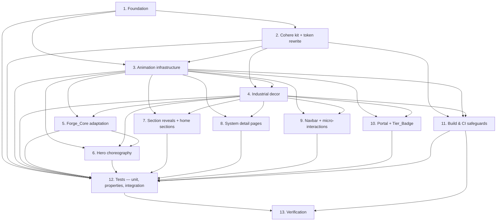

# Implementation Plan: Light_Theme Industrial Redesign

## Overview

Convert the feature design into a series of prompts for a code-generation LLM that will implement each step with incremental progress. Make sure that each prompt builds on the previous prompts, and ends with wiring things together. There should be no hanging or orphaned code that isn't integrated into a previous step. Focus ONLY on tasks that involve writing, modifying, or testing code.

This plan executes the redesign in thirteen phases, in the order documented in `design.md` § Components and Interfaces: foundation → tokens → animation → decor → Forge_Core → hero → sections → systems → navbar/micro-interactions → portal → CI safeguards → tests → verification. Every leaf task names the files it touches (using the existing repository paths), the requirement clauses it satisfies, and the design section / property it implements. Test sub-tasks are marked optional with `*` and may be skipped for a faster MVP, but the property and integration suites are needed to discharge the universal invariants.

## Tasks

- [ ] 1. Foundation — pin libraries, scaffold animation/decor folders, wire the test toolchain
  - [ ] 1.1 Pin runtime libraries and add the test devDependencies
    - In `package.json`, add `gsap` and `framer-motion` as `dependencies` with **exact** version strings (no `^` / `~`). Add `vitest`, `@vitest/ui`, `fast-check`, `@playwright/test`, `@lhci/cli`, `jsdom`, and `@testing-library/react` + `@testing-library/jest-dom` as `devDependencies`, also exact-pinned. Run `pnpm install` so `pnpm-lock.yaml` records the resolved versions for clean-install reproducibility. Add npm scripts: `test`, `test:unit` (`vitest run src/__tests__/unit src/__tests__/properties`), `test:e2e` (`playwright test`), `lhci` (`lhci autorun`), `check:dark`, `check:tokens`, `check:bundle-size`. Update `vite.config.*` (create one if absent) with a Vitest test block (`environment: 'jsdom'`, `setupFiles: ['./src/__tests__/setup.js']`).
    - _Requirements: 4.1, 4.7, 19.1, 19.2_
    - _Design: §Components and Interfaces > Animation infrastructure (exact-pin rule); §Testing Strategy (Vitest + fast-check + Playwright + Lighthouse CI as devDependencies)_
  - [ ] 1.2 Scaffold the new source directories
    - Create empty placeholder files (with JSDoc headers only) so subsequent phases land cleanly: `src/animation/gsap.js`, `src/animation/motion.js`, `src/animation/MotionConfig.jsx`, `src/components/effects/CursorFollower.jsx`, `src/components/effects/PageTransition.jsx`, `src/components/decor/BackgroundGrid.jsx`, `src/components/decor/CornerGuides.jsx`, `src/components/decor/RulerTickDivider.jsx`, `src/design/clipPaths.js`, `src/design/cohere_kit/.gitkeep`, `src/hooks/useReducedMotion.js`, `src/hooks/useSectionReveal.js`, `src/hooks/useMagnetic.js`, `src/components/portal/TierBadge.jsx`. Do not implement contents yet; subsequent tasks fill them.
    - _Requirements: 1.1, 1.7, 4.2, 4.4, 4.5, 5.1, 6.1, 6.2, 6.6, 6.7, 9.1, 11.1, 11.3, 14.6, 15.2_
    - _Design: §High-level diagram (file layout); §Components and Interfaces > Animation infrastructure; §Industrial decor layer; §Tier-gating UX in the portal_
  - [ ] 1.3 Create the `__tests__` tree mirroring the design
    - Create `src/__tests__/setup.js` (registers `@testing-library/jest-dom` matchers, configures `matchMedia` polyfill, mocks `IntersectionObserver` and `ResizeObserver`). Create empty test files for every entry in the design's test placement table — `src/__tests__/unit/{capabilities,tier-badge,contrast,animation-presets,use-reduced-motion,hero-timeline}.test.js`, `src/__tests__/unit/{navbar,upgrade-banner,locked-screen}.test.jsx`, `src/__tests__/properties/p01-hex-format.test.js` through `p15-section-purity.test.js`, and `src/__tests__/integration/{routes,hero-focus,reduced-motion,color-scheme-dark-noop,pointer-coarse,forge-context-loss,portal-locked-screen}.spec.ts`. Each file ships a single `it.skip(...)` placeholder so `pnpm test` exits 0.
    - _Requirements: 16.5, 2.7, 2.2, 2.3, 2.4, 20.1, 20.2, 20.3, 20.4, 11.1, 8.2, 9.4, 15.5, 15.6, 15.7, 15.10, 2.8, 2.9, 16.2, 6.7, 6.5, 13.1_
    - _Design: §Testing Strategy > Test placement and naming_
  - [ ] 1.4 Add a baseline Playwright config and Lighthouse CI config
    - Add `playwright.config.ts` (Chromium project matching the Desktop_Reference_Device profile: 1920×1080, scale 1, network not throttled), `lighthouserc.json` (LCP ≤ 2.5 s, CLS ≤ 0.1, three cold runs against `pnpm preview`, baseline branch comparison enabled). Wire both into the `test:e2e` and `lhci` npm scripts.
    - _Requirements: 19.3, 19.6_
    - _Design: §Testing Strategy > Visual regression and build checks (Lighthouse CI)_

- [ ] 2. Cohere_Kit adoption + token rewrite
  - [ ] 2.1 Run `npx getdesign@latest add cohere` and commit the kit
    - Execute `npx getdesign@latest add cohere` once. Move the generated artifacts under `src/design/cohere_kit/` (create the directory; **do not** scatter Cohere files anywhere else under `src/`). Commit the directory verbatim. Add a brief `src/design/cohere_kit/README.md` recording the exact CLI command, kit version, and date.
    - _Requirements: 1.1_
    - _Design: §Components and Interfaces > Token system upgrades (table row `src/design/cohere_kit/`)_
  - [ ] 2.2 Author the Cohere → Theme_Token mapping
    - Create `src/design/cohere_kit/token-mapping.md` listing every Cohere_Kit source token, its destination key path in `src/design/colors.js`, and its 6-digit hex value. Use the table in `design.md` § Cohere_Kit → Theme_Token mapping as the schema. Create the executable sketch `src/design/cohere_kit/mapping.js` that exports `COHERE_TO_THEME_TOKEN` exactly as written in `design.md` § Data Models > Cohere_Kit token mapping. Map `cohere.brand.primary` to both `colors.telemetry.primary` and `semantic.brand`.
    - _Requirements: 1.1, 1.2, 1.7_
    - _Design: §Components and Interfaces > Token system upgrades; §Data Models > Cohere_Kit token mapping_
  - [ ] 2.3 Rewrite `src/design/colors.js` with Light_Theme hex values
    - Replace every value in `src/design/colors.js` in place, preserving the six top-level `colors` keys (`background`, `text`, `telemetry`, `process`, `signal`, `border`) and the three `semantic` keys (`brand`, `alert`, `danger`) verbatim, including key ordering, indentation, single-quote style, and trailing-comma convention so `tools/theme_editor.py` re-saves remain byte-identical (Property 4). New values come from the canonical `token-mapping.md`. Borders remain `rgba()`. Maintain `alpha(border.subtle) < alpha(border.default) < alpha(border.strong)`. Confirm `colors.background.primary` luminance ∈ [0.85, 1.0] and the four contrast inequalities in the type contract (Property 3).
    - _Requirements: 1.3, 1.4, 1.5, 2.1, 2.2, 2.3, 2.4, 2.5, 2.6, 2.7, 3.4, 16.5, 20.1_
    - _Design: §Data Models > Token contract; §Cohere_Kit → Theme_Token mapping; §Property 1, §Property 2, §Property 3_
  - [ ] 2.4 Sync `src/index.css` `:root` variables and remove dark-only utilities
    - For every Theme_Token in the rewritten `src/design/colors.js`, replace its corresponding `--*` CSS variable in `:root` so the `--*` value byte-equals the JS literal (Property 12). Delete the body-level `background-image` linear-gradient grid block (it migrates to `<BackgroundGrid />`), the `@media (max-width: 768px) body { background-size: ... }` adjustment that depends on it, and every `liquid-glass*` rule (`liquid-glass`, `liquid-glass-amber`, `liquid-glass-expanded`, `liquid-glass-amber-expanded`, `tile-active-glow`). Leave the `surface-panel` family but rebase its colors onto the new tokens. Confirm zero `dark:` Tailwind variants and zero references to `prefers-color-scheme: dark` (outside intentional "render the same" comparison comments) survive in `src/index.css`.
    - _Requirements: 2.8, 2.9, 3.1, 3.2, 3.3, 3.5, 6.1, 6.7, 16.2_
    - _Design: §Components and Interfaces > Token system upgrades (`src/index.css` row); §Property 12_
  - [ ] 2.5 Confirm `tailwind.config.js` shape is unchanged
    - Open `tailwind.config.js` and verify the `theme.extend.colors` block still maps `bg → colors.background`, `txt → colors.text`, `telemetry → colors.telemetry`, `process → colors.process`, `signal → colors.signal`, `border → colors.border` and continues to import from `./src/design/colors.js`. Make no other changes. Run `pnpm build` once to confirm Tailwind can resolve every utility used in `src/`.
    - _Requirements: 1.6, 16.1, 16.3_
    - _Design: §Components and Interfaces > Token system upgrades (`tailwind.config.js` row)_
  - [ ] 2.6 Refactor every hard-coded hex literal out of section components
    - Grep `src/components/sections/**/*.jsx` and `src/pages/**/*.jsx` for `#[0-9A-Fa-f]{3,6}` outside import lines that reference `src/design/colors.js`. Replace every match with a Tailwind utility (`text-txt-primary`, `bg-bg-primary`, etc.) or a direct token reference imported from `src/design/colors.js`. Also remove the `style={{ background: '#0a0a0b' }}` literals in `src/App.jsx` (`<PageLoader>` and `<NotFoundPage>`); replace with `bg-bg-primary`. This task underwrites Property 15.
    - _Requirements: 13.1, 16.1, 16.3_
    - _Design: §Property 15_

- [ ] 3. Animation infrastructure (GSAP + Framer Motion + reduced-motion)
  - [ ] 3.1 Implement `src/animation/gsap.js` and register ScrollTrigger exactly once
    - Implement the side-effect module. Import `gsap` and `ScrollTrigger`, gate `gsap.registerPlugin(ScrollTrigger)` with a module-level `let registered = false` so HMR cannot re-register. Export `gsap`, `ScrollTrigger`, `gsapContext()` (thin wrapper around `gsap.context`), and `killAll(scope?)` that kills every active timeline and ScrollTrigger inside `scope` (or all, when scope is undefined). On registration failure, throw a `RegistrationError` and `console.warn('GSAP ScrollTrigger registration failed', err)`. Import this module **once** from `src/main.jsx` before `<App />` renders.
    - _Requirements: 4.2, 4.3, 8.4_
    - _Design: §Components and Interfaces > Animation infrastructure (`src/animation/gsap.js`); §Hero choreography > Mount + scroll + route-exit sequence_
  - [ ] 3.2 Implement `src/animation/motion.js` (canonical presets) and a preset validator
    - Translate the `easings`, `durations`, and `variants` blocks from `design.md` § Animation preset object into `src/animation/motion.js` verbatim. Export a `validatePresets()` helper that asserts every numeric bound (e.g., `durations.heroEntryTotalMs ∈ [800, 1600]`, `pageEnterMs + pageExitMs ∈ [200, 500]`, `magneticMaxTranslatePx === 8`, `forgeIdlePeriodMinMs ≥ 2000 && forgeIdlePeriodMaxMs ≤ 4000`). Call `validatePresets()` in development from `src/animation/MotionConfig.jsx` so a violation surfaces in the console at boot.
    - _Requirements: 4.6, 5.3, 8.1, 8.2, 9.1, 9.4, 10.1, 10.4, 11.1, 11.2, 11.3, 11.4, 11.5, 11.6, 12.5, 13.6_
    - _Design: §Data Models > Animation preset object_
  - [ ] 3.3 Implement `src/hooks/useReducedMotion.js`
    - Hook signature: `() => { reducedMotion: boolean, detectionFailed: boolean }`. Subscribe to `window.matchMedia('(prefers-reduced-motion: reduce)')` and re-render on `change`. Evaluate synchronously during the initial render via `useSyncExternalStore` so the value is correct **before** the first animation frame is scheduled. On `matchMedia === undefined` or a thrown access, return `{ reducedMotion: true, detectionFailed: true }` and `console.warn('Reduced motion preference detection failed')`. Apply preference changes within 500 ms of the OS event.
    - _Requirements: 5.2, 5.6, 5.7, 5.8_
    - _Design: §Components and Interfaces > Animation infrastructure (`src/hooks/useReducedMotion.js`)_
  - [ ] 3.4 Implement `src/animation/MotionConfig.jsx` and broadcast reduced-motion via context
    - Wrap children with Framer Motion's `<MotionConfig reducedMotion="user">`. Inside, expose `<ReducedMotionContext.Provider value={useReducedMotion()}>` so both Motion_Layer and GSAP_Layer hooks read the same boolean from a single source. Re-evaluate within 500 ms of an OS preference change (delegated to the hook). Call `validatePresets()` in `process.env.NODE_ENV !== 'production'`.
    - _Requirements: 5.1, 5.2, 5.6_
    - _Design: §Components and Interfaces > Animation infrastructure (`src/animation/MotionConfig.jsx`)_
  - [ ] 3.5 Replace `useScrollReveal` with `src/hooks/useSectionReveal.js`
    - Implement the hook with the signature documented in `design.md`: optional `headingSelector` (`'h1, h2'`), `subheadingSelector` (`'[data-subheading]'`), `itemsSelector` (`'[data-reveal-item]'`), `threshold` 0.15, `duration` 600 ms (clamped to [400, 900]), `offset` 32 px (clamped to [16, 48]), `stagger` 80 ms (clamped to [40, 120]). Create one `ScrollTrigger` per section, animate opacity 0→1 and `y: offset → 0`, fire exactly once, clear inline `transform`/`opacity` 50 ms after completion, skip missing elements without erroring. Multiply durations by 0.7 when `viewport ∈ [640, 1024]` px. When `reducedMotion` is true, set the final state immediately. Cap the FeatureGrid stagger window to `min(stagger × (N − 1), 1500)` ms (Property 10). After implementation, `git rm src/hooks/useScrollReveal.js` and update every consumer's import path; running `grep -r useScrollReveal src/` must return zero matches.
    - _Requirements: 9.1, 9.2, 9.3, 9.4, 9.5, 9.6, 18.3_
    - _Design: §Components and Interfaces > Animation infrastructure (`src/hooks/useSectionReveal.js`); §Property 10_
  - [ ] 3.6 Implement `src/hooks/useMagnetic.js`, `src/components/effects/CursorFollower.jsx`, `src/components/effects/PageTransition.jsx`, and wire them into `App.jsx`
    - `useMagnetic(ref)` — translate the target element toward the cursor, **clamped so `max(|dx|, |dy|) ≤ 8 px`** (Property 8). Spring back to origin within 250 ms on pointer-leave. No-op when `(pointer: coarse)` matches, viewport < 640 px, or `reducedMotion` is true. `<CursorFollower />` — single root `<motion.div>` (max radius 24 px, opacity ∈ [0.20, 0.35]); fade to 0 over 200–600 ms after 2 s of no `pointermove`; re-fade in within 200 ms on next move; return `null` for `(pointer: coarse)`, viewport < 640 px, or `reducedMotion`. `<PageTransition>` — wrap children with `<AnimatePresence mode="wait">` and a `<motion.div key={location.pathname}>` using `pageEnter`/`pageExit` variants from `motion.js`; restore scroll position within 50 ms of mount via `useLayoutEffect`; cancel a stale variant within 50 ms of a new route change; install a 1000 ms watchdog that snaps to the destination's final state and emits a single `console.warn(\`page transition exceeded budget: \${from} → \${to}\`)`. In `src/App.jsx`, mount `<MotionConfig>`between`<BrowserRouter>`and`<Routes>`(outer to`<LicenseProvider>`/`<AuthProvider>`placement preserved per existing tree), wrap`<Routes>`inside`<Suspense>`with`<PageTransition>`, and place `<CursorFollower />`once above`<Navbar />`. Register the ScrollTrigger import in `main.jsx`**before**`import App from './App.jsx'` so the plugin is ready before any component using it mounts.
    - _Requirements: 4.4, 4.5, 4.6, 5.1, 5.2, 10.1, 10.2, 10.3, 10.4, 10.5, 11.1, 11.2, 11.3, 11.4, 11.5, 11.7, 11.8, 11.9, 18.2_
    - _Design: §Components and Interfaces > Animation infrastructure (CursorFollower, PageTransition, useMagnetic); §Page transition shell; §Property 8_

- [ ] 4. Industrial_Decor layer
  - [ ] 4.1 Implement `src/design/clipPaths.js`
    - Export `machinedCorner(size, corners)`, `cardClipPath` (notch on top-right corner, 12 px chamfer ∈ [8, 16] px — Property 14), and `tileClipPath` (single-corner chamfer 16 px ∈ [8, 24] px). Each function returns a CSS `clip-path: polygon(...)` string. Add unit-level inline JSDoc with chamfer-bound ranges so the property test in phase 12 can assert them.
    - _Requirements: 6.5, 14.6_
    - _Design: §Components and Interfaces > Industrial decor layer (`src/design/clipPaths.js`); §Property 14_
  - [ ] 4.2 Implement `src/components/decor/BackgroundGrid.jsx`
    - Render a fixed full-viewport grid: 1-pixel lines spaced 32 px on both axes, color `colors.border.subtle`, root style `position: fixed; inset: 0; pointer-events: none; z-index: 0`. Implement via two `linear-gradient`s on a single `
` — no SVG needed. The component is mounted **once** in `App.jsx` near the root and persists across routes.
    - _Requirements: 6.1, 6.7_
    - _Design: §Components and Interfaces > Industrial decor layer (`<BackgroundGrid />`); §Property 13_
  - [ ] 4.3 Implement `src/components/decor/CornerGuides.jsx` and `src/components/decor/RulerTickDivider.jsx`
    - `<CornerGuides />` — read the current pathname via `useLocation`. Render four absolutely-positioned SVG corner brackets only when pathname ∈ {`/`, `/technology`, `/about`, `/research`} **or** when the pathname matches `/systems/*` AND `window.innerWidth > 1024`. Each guide is two perpendicular line segments 32 px long (50 % at viewport < 640 px), offset 16 px from the edge, 1 px stroke `colors.border.default`. Re-evaluate length on `resize` within 200 ms. `pointer-events: none`. `<RulerTickDivider />` — render a horizontal divider as a sequence of ruler-tick marks, each 6 px long, spaced 12 px apart, in `colors.border.default`. Both decor components must satisfy `pointer-events: none` (Property 13).
    - _Requirements: 6.2, 6.3, 6.6, 6.7, 13.5, 14.2, 14.3, 18.1, 18.4, 18.6, 18.8_
    - _Design: §Components and Interfaces > Industrial decor layer (`<CornerGuides />`, `<RulerTickDivider />`); §Property 13_
  - [ ] 4.4 Mount the decor in `App.jsx` and apply machined-corner clips to every card surface
    - Inside `App.jsx`, mount `<BackgroundGrid />` and `<CornerGuides />` once at the root (inside the providers but outside `<Suspense>`). Update `src/components/ProductCard.jsx`, `src/components/LockedProductCard.jsx`, `src/components/ProductDownloadCard.jsx`, `src/components/RollbackVersionCard.jsx`, and `src/components/UpgradeBanner.jsx` to apply `style={{ clipPath: cardClipPath }}` (or a dedicated CSS class that resolves to the same string) to the outer card surface. Remove any hard-coded `border-radius` on those surfaces that would compete with the chamfered corner.
    - _Requirements: 6.5, 6.7, 14.6_
    - _Design: §Page transition shell (mount layout); §Components and Interfaces > Industrial decor layer (consumers table); §Property 14_

- [ ] 5. Forge_Core adaptation
  - [ ] 5.1 Adapt silhouette contrast and brand emissive in `src/three/ForgeCore.jsx`
    - Adjust the icosahedron's base material and rim light so any sampled silhouette edge pixel maintains Contrast_Ratio ≥ 1.4 against the new `colors.background.primary` at every rendered frame. Source the emissive accent from `semantic.brand` (which equals `colors.telemetry.primary`); read the value at mount via `import { semantic } from '../design/colors'`.
    - _Requirements: 7.1, 7.2_
    - _Design: §Components and Interfaces > Forge_Core adaptation (silhouette contrast, brand accent)_
  - [ ] 5.2 Cap mobile pixel ratio and pause/resume the render loop with IntersectionObserver in `src/three/ForgeCore.jsx`
    - Clamp `renderer.setPixelRatio(Math.min(window.devicePixelRatio, viewportWidth < 768 ? 1.5 : 2))`. Attach an `IntersectionObserver` on the hero section's bounding rect: pause `requestAnimationFrame` when fully off-screen and resume within 200 ms when re-entering. Ensure no `requestAnimationFrame` leaks across `useEffect` cleanup.
    - _Requirements: 7.3, 7.4, 7.5, 7.6_
    - _Design: §Components and Interfaces > Forge_Core adaptation (pixel-ratio cap, off-screen pause)_
  - [ ] 5.3 Implement WebGL context-loss SVG fallback and reduced-motion final pose in `src/three/ForgeCore.jsx`
    - Listen for `webglcontextlost` on the canvas. On loss, replace the canvas with a static `<svg>` whose accent is `semantic.brand`, preserving the original layout box. Emit exactly one `console.warn('Forge_Core WebGL context lost')` per page load. When `reducedMotion` is true (read from `ReducedMotionContext`), render a single deterministic final-pose frame and skip the rotation animation.
    - _Requirements: 5.4, 5.5, 7.7, 21.5_
    - _Design: §Components and Interfaces > Forge_Core adaptation (WebGL context-loss, reduced-motion final pose); §Error Handling table (WebGL context lost, Reduced_Motion)_
  - [ ] 5.4 Drive ambient idle pulse from the GSAP_Layer
    - Track the last `pointermove`, `scroll`, `keydown`, and `touchstart` timestamp at the document level. After 8 s of inactivity, start a `gsap.timeline({ repeat: -1, yoyo: true })` on the Forge_Core wrapper with scale ∈ [0.98, 1.02] and period ∈ [2 s, 4 s]. Kill the timeline on the next user event. Suppress entirely when `reducedMotion` is true. Update `src/three/FloatingGeometry.jsx` if it carries any continuous-particle motion that conflicts with reduced motion (Req 5.5).
    - _Requirements: 5.5, 11.6, 11.9_
    - _Design: §Components and Interfaces > Forge_Core adaptation (idle pulse)_

- [ ] 6. Hero choreography
  - [ ] 6.1 Wire the labeled GSAP entry timeline inside `src/components/sections/HeroSection.jsx`
    - Inside a `useLayoutEffect` scoped via `gsapContext(() => { ... }, heroRef)`, build the timeline exactly as documented in `design.md` § Hero choreography: labels `wordmark` → `tagline` → `cta` → `forge`, total duration ≈ 1.2 s, bounded ∈ [0.8, 1.6] s. Each element transitions from opacity 0 to 1 and reaches its final position by the timeline's end. When `reducedMotion` is true, construct the timeline `paused: true` then `tl.progress(1).pause()` so all elements snap to their final pose before the first animation frame. Ensure the wordmark, tagline, CTA, and Forge wrapper carry stable `ref`s. Keep the primary CTA, every Navbar link, and every focusable element fully interactive throughout the timeline (Req 8.3, 17.1).
    - _Requirements: 5.4, 8.1, 8.3, 8.5, 17.1, 17.2_
    - _Design: §Hero choreography (timeline structure)_
  - [ ] 6.2 Attach scroll-linked Forge_Core parallax via ScrollTrigger and clean up on unmount
    - Inside the same `gsapContext`, add a `ScrollTrigger.create({ trigger: heroRef.current, start: 'top top', end: 'bottom top', scrub: true, onUpdate: self => gsap.set(forgeRef.current, { y: self.progress * 120 }) })`. The mapping is monotonic in `self.progress ∈ [0, 1]` and bounded to `[0, 120]` px (Property 9). Update within 16 ms of each scroll event. The cleanup function (`gsapContext` `revert()` plus an explicit `ScrollTrigger.getAll().filter(t => t.scope === heroRef).forEach(t => t.kill())`) MUST release every timeline and ScrollTrigger reference before the next page mounts (Req 8.4) so no animation callbacks survive a route change.
    - _Requirements: 8.2, 8.4_
    - _Design: §Hero choreography (mount + scroll + route-exit sequence); §Property 9_

- [ ] 7. Section reveals + home / marketing sections
  - [ ] 7.1 Apply `useSectionReveal` to every section under `src/components/sections/**`
    - Attach the hook to the root `<section>` of `HeroSection.jsx`, `IndustryProblemSection.jsx`, `InspectionVisibilitySection.jsx`, `PlatformOverviewSection.jsx`, `DeploymentSection.jsx`, `ContactSection.jsx`, every file in `src/components/sections/home/` (`IndustrialMemorySection.jsx`, `IntelligenceLayersSection.jsx`, `MultiGateIntelligenceSection.jsx`, `SignalFirstAISection.jsx`), and every file in `src/components/sections/technology/`. Ensure each `<h1>` / `<h2>` is the primary heading and every subheading carries `data-subheading`. Mark FeatureGrid items with `data-reveal-item` so the stagger window applies (Property 10).
    - _Requirements: 9.1, 9.2, 9.3, 9.4, 9.5, 9.6, 18.3_
    - _Design: §Components and Interfaces > Animation infrastructure (`useSectionReveal`); §Property 10_
  - [ ] 7.2 Retarget colors per Reqs 13.1–13.9 across all home / marketing sections
    - Update every section component listed in 7.1 so the root container background resolves to `bg-bg-primary` (or `colors.background.primary`), body text resolves to Theme_Tokens, and zero hard-coded `#RRGGBB` literals remain outside `src/design/` import lines (Property 15). In `src/components/sections/home/IndustrialMemorySection.jsx` (the home equivalent of "Ecosystem"), set flow-diagram strokes to `colors.process.primary` and node fills to `colors.background.primary`. In `src/components/sections/DeploymentSection.jsx`, set on-premise architecture strokes to `colors.telemetry.primary`. In `src/components/sections/ContactSection.jsx`, give the founder email and LinkedIn links a `colors.telemetry.primary` underline on `:focus-visible`.
    - _Requirements: 13.1, 13.2, 13.3, 13.4, 13.9_
    - _Design: §Components and Interfaces > Industrial decor layer (consumers table — `IndustrialMemorySection`, `DeploymentSection`, `ContactSection`); §Property 15_
  - [ ] 7.3 Insert `<RulerTickDivider />` between architectural zones in `DeploymentSection`
    - In `src/components/sections/DeploymentSection.jsx`, render a `<RulerTickDivider />` between every adjacent pair of architectural zones (e.g., between the on-premise zone and the cloud zone, between the cloud zone and the telemetry zone). The divider must inherit `pointer-events: none` from the decor layer (Property 13).
    - _Requirements: 6.6, 6.7, 13.5_
    - _Design: §Components and Interfaces > Industrial decor layer (`RulerTickDivider`); §Property 13_
  - [ ] 7.4 Retarget `ProductCard` defect grid and ProductSlider transition
    - In `src/components/ProductCard.jsx`, retarget defect-grid cell colors to `colors.signal.warning` and `colors.background.primary` on the new light surface; verify the `defectPulse` keyframes in `src/index.css` still render against the new background. Add a 50 % viewport-area gate (`IntersectionObserver` thresholds `[0.1, 0.5]`) that drives the animated visual when ≥ 50 % is in view, pauses it when < 10 % is in view, and retains the last frame on pause (Req 13.7, 13.8). In the ProductSlider component (locate via grep — owned by `ProductCard` family or a slider sibling under `src/components/`), animate the horizontal card transition with Framer Motion using `durations.productSliderMs` (320 ms ∈ [200, 450]).
    - _Requirements: 13.6, 13.7, 13.8, 13.10_
    - _Design: §Data Models > Animation preset object (`productSliderMs`); §Components and Interfaces > Industrial decor layer (consumers table — `ProductCard`)_
  - [ ] 7.5 Checkpoint — sections render light-themed and reveal cleanly
    - Ensure all tests pass, ask the user if questions arise.
    - _Requirements: 9.1, 9.6, 13.1, 13.10_
    - _Design: §Hero choreography; §Components and Interfaces > Industrial decor layer_

- [ ] 8. System detail pages
  - [ ] 8.1 Light-theme `RejectionAnalysisSystem.jsx` and `PlantIntelligence.jsx`
    - In `src/pages/systems/RejectionAnalysisSystem.jsx` and `src/pages/systems/PlantIntelligence.jsx`, set the page root background to `colors.background.primary`, body text to `colors.text.primary`, and muted metadata to `colors.text.muted`. Eliminate any hard-coded hex literal not sourced from `src/design/colors.js`. Confirm `<CornerGuides />` (mounted in `App.jsx`) renders only on viewport > 1024 px for these system routes via the pathname-+-width gate from task 4.3.
    - _Requirements: 14.1, 14.2, 14.3, 18.1, 18.4, 18.6_
    - _Design: §Components and Interfaces > Industrial decor layer (consumers table — system detail pages)_
  - [ ] 8.2 Drive `SystemImageBlock` reveal via `useSectionReveal`
    - In `src/components/systems/SystemImageBlock.jsx`, attach `useSectionReveal` keyed to the block's root with `threshold: 0.10` so the reveal fires once when ≥ 10 % of the block is in view. Animation duration must remain in [400, 900] ms.
    - _Requirements: 14.4_
    - _Design: §Components and Interfaces > Animation infrastructure (`useSectionReveal`)_
  - [ ] 8.3 Update `SystemWorkflow` connectors and `SystemImpactGrid` tiles
    - In `src/components/systems/SystemWorkflow.jsx`, set connector lines to `colors.border.strong` with stroke width ∈ [1, 3] px and node labels to `colors.text.primary`. In `src/components/systems/SystemImpactGrid.jsx`, apply `tileClipPath` from `src/design/clipPaths.js` to every tile and render an empty-state indicator (no tiles) when impact data is empty.
    - _Requirements: 14.5, 14.6, 14.7_
    - _Design: §Components and Interfaces > Industrial decor layer (consumers table — `SystemWorkflow`, `SystemImpactGrid`)_

- [ ] 9. Navbar + micro-interactions
  - [ ] 9.1 Implement Navbar transparent ↔ surfaced state in `src/components/navigation/Navbar.jsx`
    - Track `window.scrollY` via a `scroll` listener (passive, throttled with `requestAnimationFrame`). Below 16 px the Navbar root has `background: rgba(0,0,0,0)` and no bottom border; at ≥ 16 px the background sources from `colors.background.primary` at α ∈ [0.85, 0.95] with a 1 px `colors.border.subtle` bottom border. Animate the transition with Framer Motion over `durations.navbarSurfaceMs` (220 ms ∈ [150, 300]). When `reducedMotion` is true, snap with no transition.
    - _Requirements: 12.1, 12.2, 12.5, 12.6_
    - _Design: §Components and Interfaces > Industrial decor layer (consumers table — Navbar)_
  - [ ] 9.2 Add focus ring and active-link color in Navbar
    - On `:focus-visible`, render a focus ring ≥ 2 px thick with Contrast_Ratio ≥ 3.0 against `colors.background.primary` (use a Tailwind `ring-2 ring-telemetry-primary ring-offset-2 ring-offset-bg-primary` chain or equivalent). The link whose target equals the current pathname renders foreground `colors.telemetry.primary`; every other link renders `colors.text.primary`.
    - _Requirements: 12.3, 12.4_
    - _Design: §Components and Interfaces > Industrial decor layer (consumers table — Navbar)_
  - [ ] 9.3 Apply `useMagnetic` to every primary CTA
    - Attach `useMagnetic` to the Hero CTA (in `HeroSection.jsx`), the Navbar Portal button (in `Navbar.jsx`), the upgrade CTA inside `src/components/UpgradeBanner.jsx`, and the upgrade CTA inside `src/components/LockedScreen.jsx`. The hook's clamp (max 8 px / 250 ms return / coarse-pointer + reduced-motion guards) must be unchanged from task 3.6.
    - _Requirements: 11.1, 11.2, 11.7, 11.8, 11.9, 18.2_
    - _Design: §Components and Interfaces > Animation infrastructure (`useMagnetic`); §Property 8_
  - [ ] 9.4 Confirm `<CursorFollower />` mounting + coarse-pointer + reduced-motion guards
    - With `<CursorFollower />` mounted once near `App.jsx`'s root (from task 3.6), verify it returns `null` for `(pointer: coarse)`, viewport < 640 px, or `reducedMotion === true`. Verify the magnetic effect on every CTA from 9.3 is suppressed under the same conditions.
    - _Requirements: 11.3, 11.4, 11.5, 11.7, 11.9, 18.2, 18.5, 18.7_
    - _Design: §Components and Interfaces > Animation infrastructure (`<CursorFollower />`)_

- [ ] 10. Portal + Tier_Badge
  - [ ] 10.1 Implement `tierToBadgeState(tier, productId)` in `src/lib/capabilities.js`
    - Add the pure mapper exactly per `design.md` § Tier-gating UX in the portal table: `ras_core` (and TIER_1) → `ACTIVE` for RAS Core, else `LOCKED`; `ras_enterprise` (and TIER_2) → `ACTIVE` for RAS Core and RAS Enterprise, `LOCKED` for Plant Intelligence; `full_stack` (and TIER_3) → `ACTIVE` for RAS Core and Plant Intelligence, `INCLUDED` for RAS Enterprise; any unrecognized or undefined tier → `LOCKED` for every product. Reuse the existing `normalizeTierName` helper. Export `tierToBadgeState` from `src/lib/capabilities.js`.
    - _Requirements: 15.5, 15.6, 15.7, 15.10_
    - _Design: §Tier-gating UX in the portal (mapping table); §Data Models > Tier_Badge state and tier mapper; §Property 11_
  - [ ] 10.2 Implement `<Tier_Badge />` in `src/components/portal/TierBadge.jsx`
    - Component prop signature: `{ state: 'ACTIVE' | 'INCLUDED' | 'LOCKED', productId: string }`. **ACTIVE** — literal text `ACTIVE`, foreground `colors.signal.warning`, 1 px border `colors.signal.warning` at α ∈ [0.3, 0.5]. **INCLUDED** — literal text `INCLUDED`, foreground `colors.text.muted`, 1 px border `colors.text.muted` at α ∈ [0.3, 0.5]. **LOCKED** — foreground `colors.text.muted`, lock icon (reuse the existing icon already used by `LockedProductCard`/`LockedScreen`), upgrade CTA with accent `colors.signal.warning`. Activating the LOCKED CTA navigates to the upgrade flow.
    - _Requirements: 15.2, 15.3, 15.4_
    - _Design: §Tier-gating UX in the portal (badge visual contract)_
  - [ ] 10.3 Wire `<Tier_Badge />` into `PortalDashboard`, `PortalDownloads`, `LockedProductCard`, `LockedScreen`, `UpgradeBanner`
    - In `src/pages/PortalDashboard.jsx`, render a `<Tier_Badge state={tierToBadgeState(tier, productId)} productId={productId} />` on each of the RAS Core, RAS Enterprise, and Plant Intelligence cards. Mirror in `src/pages/PortalDownloads.jsx`. In `src/components/LockedProductCard.jsx`, render a `LOCKED` badge. In `src/components/LockedScreen.jsx`, ensure the screen renders the lock icon, the feature title matching the guarded route's product name, the minimum-required-tier upgrade message, and the upgrade CTA — all colors from Theme_Tokens. Compute `<UpgradeBanner />` visibility as `tier !== 'full_stack' && tier !== 'TIER_3'` (treating those as equivalent through `normalizeTierName`); show the banner for unrecognized / undefined tiers.
    - _Requirements: 15.4, 15.5, 15.6, 15.7, 15.8, 15.9, 15.10_
    - _Design: §Tier-gating UX in the portal (state machine); §Components and Interfaces > Industrial decor layer (consumers table — UpgradeBanner, LockedScreen, portal pages)_
  - [ ] 10.4 Light-theme `PortalLogin`, `PortalDashboard`, `PortalDownloads`
    - In `src/pages/PortalLogin.jsx`, `src/pages/PortalDashboard.jsx`, and `src/pages/PortalDownloads.jsx`, set root background to `colors.background.primary`, body text to `colors.text.primary`, muted metadata to `colors.text.muted`. Remove every hard-coded hex literal outside `src/design/` imports.
    - _Requirements: 15.1_
    - _Design: §Components and Interfaces > Industrial decor layer (consumers table — portal pages)_
  - [ ] 10.5 Checkpoint — portal renders correct badges per tier
    - Ensure all tests pass, ask the user if questions arise.
    - _Requirements: 15.5, 15.6, 15.7, 15.8, 15.10_
    - _Design: §Tier-gating UX in the portal_

- [ ] 11. Build & CI safeguards
  - [ ] 11.1 Implement the `dark:` grep script
    - Add `scripts/check-dark-prefix.mjs`. The script scans `src/**/*.{jsx,js,ts,tsx,css,html}` (use `fast-glob`) for the string `dark:`, the identifier `useTheme`, and `ThemeProvider`. On any match, exit non-zero and print every match with file path, line number, and the offending line. Wire as the `check:dark` npm script and into the `prebuild` hook so `pnpm build` fails on any match.
    - _Requirements: 3.2, 3.5_
    - _Design: §Testing Strategy > Visual regression and build checks (`dark:` lint script); §Error Handling table (`dark:` Tailwind variant)_
  - [ ] 11.2 Implement the theme-integrity check
    - Add `scripts/check-theme-tokens.mjs`. Import `colors` and `semantic` from `src/design/colors.js`. Read `src/index.css` and parse `:root` declarations. For every Theme_Token leaf, assert exactly one matching `--*` CSS variable resolves to the byte-equal value. Exit non-zero and print every mismatched / missing token by key path on failure. Wire as `check:tokens` and into `prebuild`.
    - _Requirements: 2.8, 2.9, 16.2, 16.4_
    - _Design: §Testing Strategy > Visual regression and build checks (Theme integrity check); §Property 12_
  - [ ] 11.3 Implement the bundle-size diff script
    - Add `scripts/check-bundle-size.mjs`. After `vite build`, sum gzipped sizes of every `.js` and `.css` asset in `dist/`. Compare against `scripts/bundle-baseline.json` (committed; populated by 13.3). Fail the build when the JS delta exceeds 120 KB or the CSS delta exceeds 30 KB. Additionally fail when the combined gzipped size of every chunk that imports from `gsap` or `framer-motion` (resolved via the build manifest) exceeds 90 KB. Wire as `check:bundle-size` and into `postbuild`.
    - _Requirements: 4.7, 19.1, 19.2, 19.5_
    - _Design: §Testing Strategy > Visual regression and build checks (Bundle-size diff)_
  - [ ] 11.4 Wire Lighthouse CI to the build pipeline
    - In `lighthouserc.json` (from task 1.4), assert LCP ≤ 2.5 s and CLS ≤ 0.1 on `/` for the median of three cold runs, against `pnpm preview`. Add `lhci` to the `verify` npm script. Document failure semantics in `scripts/README.md`: an LHCI failure marks release verification as failed (Req 19.6).
    - _Requirements: 19.3, 19.4, 19.6_
    - _Design: §Testing Strategy > Visual regression and build checks (Lighthouse CI)_

- [ ] 12. Tests — Vitest unit, fast-check properties, Playwright integration
  - [ ]\* 12.1 Vitest unit suite
    - Implement every unit test file scaffolded in 1.3: `src/__tests__/unit/capabilities.test.js` (every recognized tier), `tier-badge.test.js` (every cell in the spec table — mirrors Property 11 as a sanity floor), `contrast.test.js` (WCAG 2.1 luminance on `#000000`/`#ffffff` ≈ 21, equal pair = 1.0; then exercises `text.primary`, `text.secondary`, `text.muted`, `telemetry.primary`, `signal.warning`, `signal.danger` against `background.primary`), `animation-presets.test.js` (every numeric bound in `motion.js`), `use-reduced-motion.test.js` (`matchMedia` true / throws), `hero-timeline.test.js` (label order `wordmark < tagline < cta < forge` and `tl.totalDuration() ∈ [0.8, 1.6]`), `navbar.test.jsx` (transparent at scrollY=0, surfaced at scrollY=16), `upgrade-banner.test.jsx` (`tier='full_stack'` returns `null`; unrecognized tier renders banner), `locked-screen.test.jsx` (lock icon + product name + minimum-tier message + upgrade CTA, all colors resolved from Theme_Tokens).
    - _Requirements: 1.4, 2.2, 2.3, 2.4, 5.6, 5.7, 8.1, 12.1, 12.2, 15.5, 15.6, 15.7, 15.8, 15.9, 15.10, 16.5, 21.1, 21.2_
    - _Design: §Testing Strategy > Unit tests (every entry)_
  - [ ]\* 12.2 Property test P1 — every Theme_Token hex matches `^#[0-9a-f]{6}$`
    - Implement `src/__tests__/properties/p01-hex-format.test.js` with header `// Feature: light-theme-industrial-redesign, Property 1: every Theme_Token hex matches ^#[0-9a-f]{6}$`. Use `fast-check` (≥ 100 iterations) to traverse every leaf of `colors` in categories `background`, `text`, `telemetry`, `process`, `signal` and assert the value matches the regex.
    - _Requirements: 1.4, 16.5_
    - _Design: §Property 1_
  - [ ]\* 12.3 Property test P2 — border alpha monotonicity
    - Implement `src/__tests__/properties/p02-border-alpha.test.js` with header `// Feature: light-theme-industrial-redesign, Property 2: border alpha monotonicity`. Assert `alpha(border.subtle) < alpha(border.default) < alpha(border.strong)` and every alpha component lies in `[0.0, 1.0]`. Use a fast-check arbitrary that produces structurally valid `colors.border` objects to verify the helper that extracts alpha is correct under input variation.
    - _Requirements: 2.7_
    - _Design: §Property 2_
  - [ ]\* 12.4 Property test P3 — Light_Theme contrast invariants
    - Implement `src/__tests__/properties/p03-contrast.test.js` with header `// Feature: light-theme-industrial-redesign, Property 3: Light_Theme contrast invariants`. Assert `contrast(text.primary, background.primary) ≥ 7.0`, `contrast(text.secondary, background.primary) ≥ 4.5`, `contrast(text.muted, background.primary) ≥ 3.0` using the WCAG 2.1 formula. Use a fast-check arbitrary that produces hex pairs to verify the contrast helper itself before exercising the live tokens.
    - _Requirements: 2.2, 2.3, 2.4_
    - _Design: §Property 3_
  - [ ]\* 12.5 Property test P4 — Theme_Editor idempotent save
    - Implement `src/__tests__/properties/p04-editor-idempotent.test.js` with header `// Feature: light-theme-industrial-redesign, Property 4: Theme_Editor idempotent save`. Drive `tools/theme_editor.py` (or its JS-side regex emulator if Python isn't invoked from Vitest — see design.md) with a `colorMap` arbitrary; assert two consecutive saves of the same map produce byte-identical files (key ordering, indentation, quoting, line endings preserved).
    - _Requirements: 20.1_
    - _Design: §Property 4_
  - [ ]\* 12.6 Property test P5 — Theme_Editor export-import round trip
    - Implement `src/__tests__/properties/p05-editor-roundtrip.test.js` with header `// Feature: light-theme-industrial-redesign, Property 5: Theme_Editor export-import round trip`. For any `colorMap`, export to JSON, import the JSON, save, re-parse — every Theme_Token key path's value equals the original.
    - _Requirements: 20.2_
    - _Design: §Property 5_
  - [ ]\* 12.7 Property test P6 — Theme_Editor confluence on distinct keys
    - Implement `src/__tests__/properties/p06-editor-confluence.test.js` with header `// Feature: light-theme-industrial-redesign, Property 6: Theme_Editor confluence on distinct keys`. For two edits at distinct key paths, applying `[e1, e2]` and `[e2, e1]` must produce byte-identical files.
    - _Requirements: 20.3_
    - _Design: §Property 6_
  - [ ]\* 12.8 Property test P7 — Theme_Editor last-write-wins on same key
    - Implement `src/__tests__/properties/p07-editor-last-write.test.js` with header `// Feature: light-theme-industrial-redesign, Property 7: Theme_Editor last-write-wins on same key`. For two edits at the same key path, applying them in sequence yields a value equal to the most recent edit.
    - _Requirements: 20.4_
    - _Design: §Property 7_
  - [ ]\* 12.9 Property test P8 — magnetic translation clamp
    - Implement `src/__tests__/properties/p08-magnetic-clamp.test.js` with header `// Feature: light-theme-industrial-redesign, Property 8: magnetic translation clamp`. For any `(dx, dy)` from `[-10000, 10000]`, the magnetic translation `(tx, ty)` written by `useMagnetic` satisfies `|tx| ≤ 8` and `|ty| ≤ 8`.
    - _Requirements: 11.1_
    - _Design: §Property 8_
  - [ ]\* 12.10 Property test P9 — Forge_Core parallax range and monotonicity
    - Implement `src/__tests__/properties/p09-parallax.test.js` with header `// Feature: light-theme-industrial-redesign, Property 9: Forge_Core parallax range and monotonicity`. For any `p1, p2 ∈ [0, 1]` with `p1 ≤ p2`, the parallax map `f` satisfies `0 ≤ f(p1) ≤ f(p2) ≤ 120`.
    - _Requirements: 8.2_
    - _Design: §Property 9_
  - [ ]\* 12.11 Property test P10 — FeatureGrid stagger window bound
    - Implement `src/__tests__/properties/p10-feature-grid-stagger.test.js` with header `// Feature: light-theme-industrial-redesign, Property 10: FeatureGrid stagger window bound`. For any `N ∈ [1, 100]` and `d ∈ [40, 120]` ms, the total stagger window emitted by `useSectionReveal` is `≤ 1500` ms.
    - _Requirements: 9.4_
    - _Design: §Property 10_
  - [ ]\* 12.12 Property test P11 — tier → Tier_Badge mapping table
    - Implement `src/__tests__/properties/p11-tier-badge.test.js` with header `// Feature: light-theme-industrial-redesign, Property 11: tier to Tier_Badge mapping table`. For every recognized tier-product pair the result equals the table row; for every unrecognized tier the result is `LOCKED` for every product. Use the `tier` arbitrary covering legacy aliases (`ras_core`, `ras_enterprise`, `full_stack`), current TIER\_\* aliases, explicit `undefined`, and `fc.string()` for unrecognized strings.
    - _Requirements: 15.5, 15.6, 15.7, 15.10_
    - _Design: §Property 11_
  - [ ]\* 12.13 Property test P12 — Theme_Token / CSS-variable parity
    - Implement `src/__tests__/properties/p12-token-css-parity.test.js` with header `// Feature: light-theme-industrial-redesign, Property 12: Theme_Token / CSS-variable parity`. For every Theme_Token leaf, exactly one CSS custom property in `src/index.css` resolves to the byte-equal value; no Theme_Token is left without a `--*` counterpart.
    - _Requirements: 2.8, 2.9, 16.2_
    - _Design: §Property 12_
  - [ ]\* 12.14 Property test P13 — Industrial_Decor pointer transparency
    - Implement `src/__tests__/properties/p13-decor-pointer-events.test.jsx` with header `// Feature: light-theme-industrial-redesign, Property 13: Industrial_Decor pointer transparency`. For every DOM node rendered by `<BackgroundGrid />`, `<CornerGuides />`, and `<RulerTickDivider />`, the computed `pointer-events` style equals `none`.
    - _Requirements: 6.7_
    - _Design: §Property 13_
  - [ ]\* 12.15 Property test P14 — card surface machined-corner clip
    - Implement `src/__tests__/properties/p14-card-clip-path.test.jsx` with header `// Feature: light-theme-industrial-redesign, Property 14: card surface machined-corner clip`. Render `ProductCard`, `LockedProductCard`, `ProductDownloadCard`, `RollbackVersionCard`, and `UpgradeBanner` with arbitrary valid props from a fast-check arbitrary; assert the rendered DOM has a `clip-path` style with at least one corner whose chamfer length is in `[8, 16]` px.
    - _Requirements: 6.5_
    - _Design: §Property 14_
  - [ ]\* 12.16 Property test P15 — section file purity from hard-coded hex
    - Implement `src/__tests__/properties/p15-section-purity.test.js` with header `// Feature: light-theme-industrial-redesign, Property 15: section file purity from hard-coded hex`. Walk every file under `src/components/sections/`, `src/components/sections/home/`, and `src/components/sections/technology/`; the count of `#[0-9A-Fa-f]{3,6}` substrings outside import lines that reference `src/design/` is zero.
    - _Requirements: 13.1_
    - _Design: §Property 15_
  - [ ]\* 12.17 Playwright integration suite
    - Implement every spec scaffolded in 1.3 against the production build (`pnpm preview`): `src/__tests__/integration/routes.spec.ts` (route transitions stay under 500 ms wall-clock for `/`, `/technology`, `/about`, `/research`, with scroll restored within 50 ms — Reqs 10.1, 10.2); `hero-focus.spec.ts` (Tab traversal during the entry timeline reaches every visible Navbar link without being stolen, primary-CTA click mid-animation fires within 50 ms — Reqs 8.3, 17.1, 17.3); `reduced-motion.spec.ts` (under `prefers-reduced-motion: reduce`, scrolling produces no `transform` change on the Forge_Core wrapper — Reqs 5.1, 5.6, 8.5); `color-scheme-dark-noop.spec.ts` (under `prefers-color-scheme: dark`, `/`, `/about`, `/portal/dashboard` are pixel-identical to default — Req 3.3); `pointer-coarse.spec.ts` (cursor follower suppressed and magnetic translation removed — Reqs 11.7, 11.8, 18.2); `forge-context-loss.spec.ts` (force WebGL context loss via `WEBGL_lose_context`; SVG fallback renders — Reqs 7.7, 21.5); `portal-locked-screen.spec.ts` (LockedScreen appears on `/portal/pi` for a `ras_enterprise` user and the dashboard renders the correct Tier_Badge tuple per tier — Reqs 15.5–15.9).
    - _Requirements: 3.3, 5.1, 5.6, 7.7, 8.3, 8.5, 10.1, 10.2, 11.7, 11.8, 15.5, 15.6, 15.7, 15.9, 17.1, 17.3, 18.2, 21.5_
    - _Design: §Testing Strategy > Integration tests (every bullet)_

- [ ] 13. Verification — build, performance, and end-to-end gating
  - [ ] 13.1 Capture pre-feature bundle baselines
    - On the commit immediately preceding the first commit of this feature, run `pnpm build` and record gzipped sizes of every JS and CSS asset into `scripts/bundle-baseline.json`. Commit the baseline. The bundle-size diff in 11.3 reads from this file.
    - _Requirements: 19.1, 19.2_
    - _Design: §Testing Strategy > Visual regression and build checks (Bundle-size diff)_
  - [ ] 13.2 Run the full verify pipeline
    - Add a single `verify` npm script that runs, in order, `pnpm check:dark`, `pnpm check:tokens`, `pnpm build`, `pnpm check:bundle-size`, `pnpm test`, `pnpm test:e2e`, `pnpm lhci`. Fail on the first non-zero exit. Document expected output in `scripts/README.md`.
    - _Requirements: 3.5, 16.4, 19.1, 19.2, 19.3, 19.5, 19.6_
    - _Design: §Testing Strategy > Visual regression and build checks (every bullet)_
  - [ ] 13.3 Final checkpoint — full verification gate
    - Ensure all tests pass, ask the user if questions arise.
    - _Requirements: 3.5, 4.7, 16.4, 19.1, 19.2, 19.3, 19.4, 19.5, 19.6_
    - _Design: §Testing Strategy (full track)_

## Notes

- Sub-tasks marked with `*` (every test sub-task in phase 12) are optional and can be skipped for faster MVP, but the property and integration suites are required to discharge the universal invariants.
- Each task references specific Requirement IDs and Design sections / Properties for traceability.
- Checkpoints (7.5, 10.5, 13.3) provide incremental validation between phases.
- Property tests validate the universal correctness properties P1–P15 from `design.md`. Each test file's first executable line is the comment header `// Feature: light-theme-industrial-redesign, Property {N}: {short description}`.
- Unit tests cover examples and edge cases; integration tests cover cross-cutting browser behavior.
- The CI safeguards in phase 11 (the `dark:` grep, theme-integrity check, bundle-size diff, Lighthouse CI) are wired into `prebuild` / `postbuild` so a violation fails the build before any deployable artifact is produced.

## Task Dependency Graph

