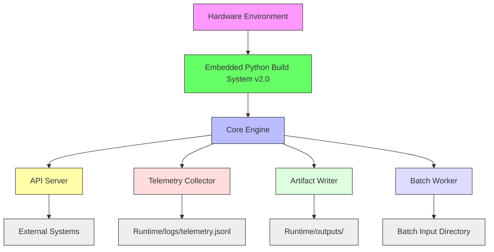

# Runtime Topology

> **Purpose:** Document deployment, API, telemetry, and artifact execution topology  
> **Related:** [Architecture](architecture.md), [Setup](../05_deployment/setup.md), [API Contracts](../06_reference/api_contracts.md)  
> **Version:** 1.0  
> **Last Updated:** 2026-05-16

---

## Overview

Runtime topology describes the structural relationships and communication pathways of the TvastrRAS system during normal operation.

The system operates as a **self-contained, edge-native industrial runtime**, requiring no cloud dependencies, external APIs, or internet connectivity after initial licensing.

---

## Component Interactions

### Core Engine
- **Role**: Orchestrates inspection pipeline, reasoning, and diagnostics
- **Modules**: `pipeline/`, `reasoning/`, `vision/`, `diagnosis/`
- **State**: Runs continuously as a background service

### API Server
- **Port**: 8000 (configurable)
- **End Points**:
  - `/inspect` — Single-image inspection
  - `/batch/list` — Batch submission
  - `/batch/{batch_id}` — Result query
  - `/batch/{batch_id}/download` — Report retrieval
  - `/health` — System status
- **Protocol**: HTTP/1.1 with JSON and multipart/form-data
- **Auth**: JWT token from license key (in `parameters.yaml`)

### Telemetry Collector
- **Input**: Per-inspection metrics from reasoning engine
- **Output**: 
  - `runtime/logs/telemetry.jsonl` (lines of JSON)
  - Aggregated into `runtime/logs/summary.json`
- **Fields**:
  - `latency`
  - `topology_score`
  - `scrata_confidence`
  - `energy_delta`
  - `drift_alert`
  - `decision`
- **Frequency**: One line per inspection

### Artifact Writer
- **Writes**: Inspection results in multiple formats
- **Outputs**:
  - `/outputs/inspect_{id}.jpg` — Annotated image
  - `/outputs/heatmap_{id}.png` — Defect heatmap
  - `/outputs/report_{id}.pdf` — Human-readable summary
  - `/outputs/inspection_{id}.json` — Raw data
- **Retention**: 6 months; auto-purged by batch worker

### Batch Worker
- **Monitors**: `runtime/batch_input/incoming/`
- **Action**: Processes all `.jpg/.png` files in subdirectories
- **Output**:  
  - `/outputs/batch_{id}.csv` — Tabular summary  
  - `/outputs/batch_{id}.jsonl` — Machine-readable line-delimited JSON
- **Concurrency**: Up to 4 parallel inspections (configurable)

---

## Data Flow Sequence

1. **Input**
   - Real-time: Image submitted via `/inspect`
   - Batch: File copied into `runtime/batch_input/incoming/`
2. **Core Processing**
   - Image → Feature Extraction → Signal Scoring → Fusion → Energy-Based Reasoning → Diagnosis
3. **Output**
   - **Immediate**: API response (for `/inspect`)
   - **Deferred**: Artifact written to `/outputs/`
   - **Aggregated**: Telemetry logged to `/logs/telemetry.jsonl`
   - **Batch**: CSV/JSONL generated for `/outputs/batch_*.csv`

---

## Storage and Persistence

| Directory | Purpose | Persistence | Backup |
|-----------|---------|-------------|--------|
| `runtime/logs/` | Inspection logs, telemetry, errors | 7+ years (regulatory) | Daily local archive |
| `runtime/outputs/` | Result images, PDFs, JSON | 6 months | Manual export |
| `runtime/batch_input/` | Incoming batch files | Until processed | Not backed up |
| `runtime/telemetry/` | Historical summaries | 7+ years | Auto-exported quarterly |
| `customers/castco/configs/parameters.yaml` | Runtime configuration | Permanently | Included in license bundle |

---

## Network and Firewall Requirements

| Feature | Requirement |
|--------|-------------|
| **Initial Licensing** | Outbound HTTPS to `updates.tvastr.ai` |
| **Software Updates** | Outbound HTTPS to `updates.tvastr.ai` |
| **API Exposure** | Inbound TCP port 8000 (if accessing externally) |
| **Internal Network** | No outbound traffic required after setup |
| **EDR/Firewall** | Whitelist `TvastrRAS.exe`, `python.exe`, `launcher.exe` |

> **Note**: Once licensed, **no permanent internet connection is required**. All inspections, diagnostics, and reasoning are computed locally.

---

## High Availability and Resilience

- **No Single Point of Failure**: All components are stateless or recover from logs
- **Crash Recovery**: On restart, batch worker resumes processing uncompleted inputs
- **Graceful Degradation**:
  - If LLM fails → fallback to signal-only reasoning
  - If GPU unavailable → switches to CPU mode
  - If database fails → logs to local JSON
- **Audit Trail**: All decisions are logged in `telemetry.jsonl` with timestamp, decision, and confidence

---

## Cross-References

- **Architecture**: [System Architecture](architecture.md)
- **API**: [API Contracts](../06_reference/api_contracts.md)
- **Deployment**: [Setup](../05_deployment/setup.md)
- **Configuration**: [Config Guide](../04_configuration/config_guide.md)
- **Runtime Storage**: [Runtime](../05_deployment/runtime.md)

**Version:** 1.0  
**Last Updated:** 2026-05-16