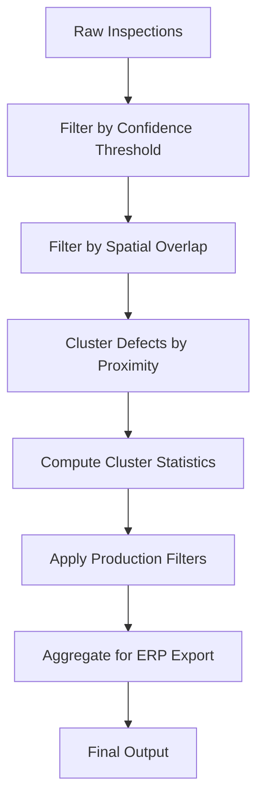

# Postprocess Pipeline

> **Purpose:** Describe postprocess logic, outlier filtering, and cluster aggregation  
> **Related:** [Runtime Execution](runtime_execution.md), [Full Pipeline](full_pipeline.md), [Energy-Based Reasoning](../03_intelligence/energy_reasoning.md)  
> **Version:** 1.0  
> **Last Updated:** 2026-05-16

---

## Overview

The postprocess pipeline is the **final stage** of defect analysis after the primary inference and reasoning engine returns a decision. It is responsible for:

1. **Filtering false positives** through spatial and statistical postprocessing
2. **Consolidating multiple detections** into unified defect clusters
3. **Aggregating results** for batch reporting and ERP export
4. **Applying production-level thresholds** that are independent of the inference model

This module operates **after** the Cognition Runtime has made its final decision — it does not alter decisions, but refines their representation and ensures consistency with production quality standards.

---

## Postprocessing Workflow



### Step 1: Filter by Confidence Threshold
- **Input**: List of detected defects from `RuntimeResponse.result.defects`
- **Action**: Reject any defect with `confidence < 0.15`
  - Purpose: Remove noise from low-confidence predictions
- **Output**: Filtered list of high-confidence defects

### Step 2: Filter by Spatial Overlap
- **Input**: Filtered defects with `location = [x, y, w, h]`
- **Action**: Compare bounding boxes for overlap using **IoU (Intersection over Union)**:
  ```python
  iou = area_intersection / area_union
  if iou > 0.6:
      # Combine overlapping detections
  ```
- **Rule**: If two defects of the same type have IoU > 0.6, merge them into a single cluster
- **Output**: Non-overlapping defect instances

### Step 3: Cluster Defects by Proximity
- **Input**: Non-overlapping defects
- **Action**: Group defects into clusters using DBSCAN:
  - **Metric**: Euclidean distance between bounding box centers
  - **Epsilon**: 15 pixels (adjustable in `parameters.yaml`)
  - **MinPts**: 2
- **Output**:
  - `clusters` list: each with:
    - `type`: defect type
    - `count`: number of detections in cluster
    - `bounding_box`: merged bounding box
    - `avg_confidence`: weighted average
    - `location`: centroid

### Step 4: Compute Cluster Statistics
- **Input**: Clusters from DBSCAN
- **Action**:
  - Compute **spread ratio**: `(cluster_width / casting_width)` — indicates spread across surface
  - Compute **variance**: Standard deviation of detection confidence within cluster
  - Compute **peak anomaly**: Maximum anomaly score among all detections in cluster
- **Output**: Enhanced cluster object with statistical properties

> These statistics are included in output for ERP downstream systems.

### Step 5: Apply Production Filters
- **Purpose**: Apply plant-specific quality rules beyond model confidence
- **Rules**:
  | Rule | Description | Action |
  |------|-------------|--------|
  | `min_cluster_count` | Reject clusters with fewer than `N` defects | If `count < 2`, down-grade to "MANUAL_REVIEW" |
  | `max_spread_ratio` | Reject if defect spread exceeds 80% of part | If `spread_ratio > 0.8`, mark as "CRITICAL" |
  | `avg_confidence_threshold` | Require minimum confidence for `REJECT` | If `avg_confidence < 0.25`, set to "ACCEPT" |
  | `peak_anomaly_threshold` | High anomaly → likely system error | If `peak_anomaly > 0.95`, trigger `pipeline_alert` and request re-calibration |

> These rules are defined in `customers/castco/configs/postprocess_rules.yaml`
>
> Example:
> ```yaml
> production_filters:
>   min_cluster_count: 2
>   max_spread_ratio: 0.8
>   avg_confidence_threshold: 0.25
>   peak_anomaly_threshold: 0.95
> ```

### Step 6: Aggregate for ERP Export
- **Input**: Final list of clusters
- **Action**:
  - Convert each cluster to ERP-compatible format
  - Attach batch ID, casting ID, timestamp
  - Generate CSV/JSONL output
- **Output**:
  ```json
  {
    "casting_id": "C00123",
    "batch_id": "BATCH-20260516-001",
    "defects": [
      {
        "type": "porosity",
        "count": 3,
        "avg_confidence": 0.87,
        "spread_ratio": 0.42,
        "variance": 0.11,
        "peak_anomaly": 0.78,
        "location": [110, 120, 80, 75],
        "status": "REJECT"
      }
    ],
    "total_rejects": 1,
    "total_accepts": 47,
    "processing_time_ms": 1200,
    "decision": "REJECT"
  }
  ```

---

## Key Output Files

| File | Location | Format | Purpose |
|------|----------|--------|---------|
| `batch_{id}.csv` | `runtime/outputs/` | CSV | ERP ingestion: one row per casting |
| `batch_{id}.jsonl` | `runtime/outputs/` | JSONL | Internal use: one line per defect cluster |
| `cluster_summary.json` | `runtime/outputs/` | JSON | Analytics: overall distribution |

> **Note**: All outputs are written after postprocessing — the Cognition Runtime never outputs cluster-merged data.

---

## Postprocessing Overrides

In cases where the inference engine's decision must be overridden for compliance or safety, use **Postprocessing Override Rules**:

```yaml
override_rules:
  - condition: "defect_type == 'crack' AND cluster_count >= 2"
    action: "FORCE_REJECT"
    reason: "Safety-critical defect"
  - condition: "avg_confidence > 0.9 AND peak_anomaly < 0.3"
    action: "FORCE_ACCEPT"
    reason: "High confidence, low anomaly — likely artifact"
```

- Overrides are evaluated **after** cluster aggregation
- Overrides can change `status` from `ACCEPT` → `REJECT` or vice versa
- All overrides are logged to `runtime/logs/postprocess_overrides.log`
- Override rules are version-controlled and deployed with system updates

> **Critical**: Override rules must be reviewed by QA team before deployment.

---

## Integration with QA Validation

- All clusters are stored in `runtime/outputs/clusters/`
- QA team can replay clusters using `scripts/replay_cluster.py`
- Cluster statistics are used to:
  - Train new models (via active learning)
  - Adjust weightings in `parameters.yaml`
  - Trigger re-calibration events

> Postprocessing outputs serve as the **ground truth** for the QA validation suite.

---

## Cross-References

- **Runtime Execution**: [Runtime Execution](runtime_execution.md)
- **Full Pipeline**: [Full Pipeline](full_pipeline.md)
- **Energy-Based Reasoning**: [Energy Reasoning](../03_intelligence/energy_reasoning.md)
- **Configuration**: [Config Guide](../04_configuration/config_guide.md)
- **Validation**: [Validation Restructuring](../05_deployment/validation.md)

**Version:** 1.0  
**Last Updated:** 2026-05-16