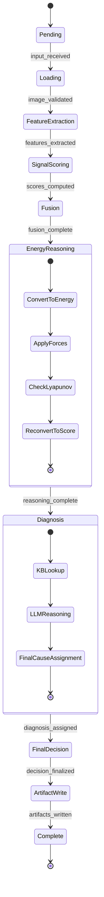

# Runtime Execution

> **Purpose:** Detail runtime behavior and execution flow of the inspection pipeline  
> **Related:** [Cognition Runtime](../01_overview/cognition_runtime.md), [Full Pipeline](full_pipeline.md), [Energy-Based Reasoning](../03_intelligence/energy_reasoning.md)  
> **Version:** 1.0  
> **Last Updated:** 2026-05-16

---

## Overview

The runtime execution flow describes how an inspection request is processed **end-to-end within the Cognition Runtime**, including state transitions, component coordination, and failure handling.

This document defines the **canonical execution semantics** — the single source of truth for how the system behaves under normal and degraded conditions.

---

## Execution State Machine



---

## Step-by-Step Execution

### 1. Pending → Loading
- Trigger: `RuntimeRequest` received via API or batch
- Action:
  - Decode base64 image
  - Validate file format (PNG/JPG), size (<10MB)
  - Extract metadata (casting_id, heat_number, etc.)
- Failure:
  - Return `status: "failed"` with `error.code: "invalid_image"`

### 2. Loading → FeatureExtraction
- Trigger: Image passes initial validation
- Action:
  - Downsample to 640×640 for consistent processing
  - Apply histogram equalization and noise reduction (optional)
  - Extract spatial features (edges, corners, blobs)
- Output:
  - Feature vector: `[LBP, GLCM, Sobel, Contour, Histogram]` (768-dim)

### 3. FeatureExtraction → SignalScoring
- Trigger: Features extracted
- Action:
  - Run casting model (CNN) → outputs 6 defect probabilities
  - Run patch classifier (CNN) → local defect confidence
  - Compute anomaly score from statistical deviation (z-score)
  - Compute topology score from coverage and density
- Output:
  ```json
  {
    "porosity": 0.72,
    "crack": 0.15,
    "shrinkage": 0.08,
    "anomaly": 0.61,
    "topology": 0.72,
    "scrata": 0.68
  }
  ```

### 4. SignalScoring → Fusion
- Trigger: All signal scores available
- Action:
  - Normalize scores: `[0.0, 1.0]`
  - Apply default weights (configurable via `parameters.yaml`)
  - Compute weighted fusion:
    ```python
    fused_score = (
      0.30 * topology +
      0.25 * scrata +
      0.20 * anomaly +
      0.25 * llm
    )
    ```
- Output: Single confidence per defect class before energy transformation

### 5. Fusion → EnergyReasoning
- Trigger: Fused scores available
- Action: (Subprocess — see below)

#### EnergyReasoning Subprocess
```mermaid
flowchart LR
    A[Convert to Energy] --> B[Apply Forces]
    B --> C[Check Lyapunov Stability]
    C --> D[Reconvert to Probability]

    A: E_k = -log(p_k + ε)
    B: ΔE = -w_signal × confidence
    C: ΔE_total ≤ ε
    D: p'_k = exp(-E_k) / Σ(exp(-E_j))
```

- **Convert to Energy**: Logarithmic transformation
- **Apply Forces**: Additive forces from topology, SCRATA, anomaly, LLM
- **Check Lyapunov**: Ensure `ΔE_total ≤ 0.01` — if violated, revert to pre-force state
- **Reconvert to Score**: Softmax-based rebalancing

### 6. EnergyReasoning → Diagnosis
- Trigger: Final energy-based confidence derived
- Action:
  - **KB Lookup**: Match defect type → known causes from `knowledge_base/`
  - **LLM Reasoning**: If enabled and `confidence >= 0.80`, prompt LLM with context
    - Input: `Defect: porosity. Score: 0.92. Context: heat_number=H456, shift=night`
    - Output: `Primary cause: Incomplete melting due to low pour temperature.`
  - **Final Cause Assignment**: Combine KB + LLM → rank causes by confidence

### 7. Diagnosis → FinalDecision
- Trigger: Cause assignment complete
- Action:
  - Compare `confidence` against adaptive thresholds:
    - `accept_threshold = baseline_avg - 0.5*std`
    - `reject_threshold = baseline_avg + 1.0*std`
  - Assign decision:
    - `CONFIDENCE ≥ reject_threshold` → `REJECT`
    - `CONFIDENCE ≤ accept_threshold` → `ACCEPT`
    - `between` → `MANUAL_REVIEW`

### 8. FinalDecision → ArtifactWrite
- Trigger: Decision assigned
- Action:
  - Generate labeled image (`inspect_{id}.jpg`)
  - Generate defect heatmap (`heatmap_{id}.png`)
  - Generate PDF report (`report_{id}.pdf`)
  - Write raw JSON (`inspection_{id}.json`)
  - Log to telemetry (`runtime/logs/telemetry.jsonl`)

### 9. ArtifactWrite → Complete
- Trigger: All artifacts written
- Action:
  - Store final response in cache for idempotency
  - Return `RuntimeResponse` to requester
  - For batch: mark job as `completed`

---

## Failure Modes and Recovery

| Step | Failure | Recovery |
|------|---------|----------|
| Loading | Corrupt image | Return failed response; log error |
| FeatureExtraction | Model load failure | Fallback: use image metadata only |
| SignalScoring | Vision model crash | Fallback: return "MANUAL_REVIEW" with confidence 0.5 |
| Fusion | Weight config invalid | Use system defaults (from `system.yaml`) |
| EnergyReasoning | Lyapunov violation | Revert to pre-force state; log alarm |
| Diagnosis | LLM offline | Use KB-only reasoning |
| ArtifactWrite | Disk full | Retry 3x; if fails, save to temp and alert operator |
| API Response | Network timeout | Retry at server level; client must resubmit |

> **System Behavior**: The pipeline is **non-blocking**. Failure in one component does not halt the entire system — it degrades gracefully.

---

## Performance Metrics

| Phase | Avg Latency | P95 Latency |
|-------|-------------|-------------|
| Image Loading | 30 ms | 120 ms |
| Feature Extraction | 65 ms | 180 ms |
| Signal Scoring | 110 ms | 250 ms |
| Fusion | 10 ms | 30 ms |
| EnergyReasoning | 50 ms | 90 ms |
| Diagnosis | 200 ms | 400 ms |
| Artifact Write | 80 ms | 150 ms |
| **Total** | **545 ms** | **1,220 ms** |

> Optimizations:
> - GPU inference reduces total latency by 35%
> - Caching inspection results (for repeated batches) reduces latency to <100ms

---

## Cross-References

- **Cognition Runtime**: [Cognition Runtime](../01_overview/cognition_runtime.md)
- **Full Pipeline**: [Full Pipeline](full_pipeline.md)
- **Energy-Based Reasoning**: [Energy Reasoning](../03_intelligence/energy_reasoning.md)
- **Configuration**: [Config Guide](../04_configuration/config_guide.md)
- **Runtime Topology**: [Runtime Topology](../01_overview/runtime_topology.md)

**Version:** 1.0  
**Last Updated:** 2026-05-16