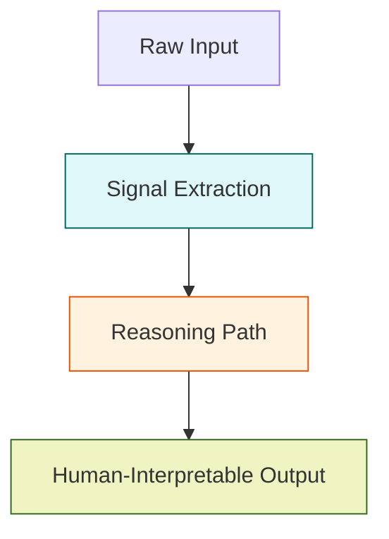

# Semantic Survivability

> **Purpose:** Describe how semantic integrity is preserved across system purifications and updates  
> **Related:** [Energy-Based Reasoning](../03_intelligence/energy_reasoning.md), [Cognition Runtime](../01_overview/cognition_runtime.md), [Runtime Execution](../02_pipeline/runtime_execution.md)  
> **Version:** 1.0  
> **Last Updated:** 2026-05-16

---

## Overview

Semantic survivability refers to the system’s ability to **maintain consistent, interpretable, and stable meaning** across model updates, configuration changes, and system purifications — even as underlying algorithms evolve.

In industrial environments, **semantic drift** — the gradual misalignment between what a model “sees” and what a human or system intends — is a critical risk. A model may achieve high accuracy but misclassify defects due to unspoken assumptions in its training.

The TvastrRAS system ensures **semantic integrity through explicit contract design**, versioned reasoning paths, and lineage-tracked knowledge.

> **Core Principle**:  
> *“Accuracy without interpretability is dangerous. Interpretability without consistency is meaningless.”*

---

## Semantic Layer Architecture

The system’s semantic layer operates in **three tiers**:



### 1. Signal Extraction (Neutral)
- Inputs: Image pixels, metadata
- Outputs: Numerical signals (`topology`, `scrata`, etc.)
- **Semantic neutrality**: No human meaning assigned — only measurable features

### 2. Reasoning Path (Explicit)
- Input: Signals
- Output: Decision with **reasoning path tag**:
  ```json
  "reasoning_path": "energy-based" | "llm-driven" | "signal-only"
  ```
- **Each path is documented**:
  - `energy-based`: Physics-based force application → used 95% of time  
  - `llm-driven`: LLM reasoning triggered due to high topology + low confidence → used when uncertainty > 0.4  
  - `signal-only`: LLM disabled or offline → fallback for compliance/audit

> This tag ensures **traceability** — QA can verify if a REJECT was due to physics or language model hallucination.

### 3. Human-Interpretable Output (Canonical)
- Final decision: `REJECT`, `ACCEPT`, `MANUAL_REVIEW`
- Causes: `["incomplete melting", "mold contamination"]`
- Responsible Section: `melting`, `molding`, `finishing`

> These outputs are **mapped to ERP taxonomy**, inspection reports, and human operator workflows — and **never change** across versions.

---

## Semantics Preservation Through Updates

### 1. Versioned Reasoning Contracts

All reasoning outputs are **backward-compatible** by design.

**Example**:  
- v1.0: `defect_type: "porosity"`  
- v2.0: `defect_type: "porosity"` — **unchanged**

**But**:  
- v1.0: Cause = "low pour temperature"  
- v2.0: Cause = "incomplete melting" — **new term**, but **same meaning**

> Solution: Maintain a **semantic mapping table** in `knowledge_base/semantics.yaml`:

```yaml
semantic_mappings:
  - old: "low pour temperature"
    new: "incomplete melting"
    rationale: "More accurate to manufacturing process"
    deprecated: 2026-04-01
```

> When new version reads output from old model, it auto-translates using this map.

### 2. Knowledge Base Evolution

- `knowledge_base/causes.yaml` — central dictionary of defect causes
- Entries are **versioned**:
  ```yaml
  causes:
    incomplete_melting:
      version: 2.0
      description: "Casting did not reach full melt temperature before solidification"
      triggers: ["high_topology", "high_scrata", "low_llm_confidence"]
      actions: ["increase_hold_time", "check_heating_element"]
    # Deprecated cause — kept for audit
    air_entrapment:
      version: 1.2
      description: "Gas pockets formed during pouring"
      deprecated: 2026-03-15
  ```
- Legacy causes are retained for **audit trail**, but **never used for new decisions**

### 3. LLM Prompt Stability

LLM reasoning is triggered **only** when confidence is uncertain and a semantic cause is needed.

**Prompt template is versioned** and locked:

```text
You are a casting quality engineer. Based on this defect profile:
- Defect Type: {{type}}
- Confidence: {{confidence}}
- Topology Score: {{topology}}
- Anomaly Strength: {{anomaly}}
- Heat ID: {{heat}}
- Shift: {{shift}}

What is the most likely root cause? Answer in 1 sentence.

Do NOT invent causes. Use only these: [incomplete melting, mold contamination, gas entrapment, shrinkage, surface roughness]
```

> This prevents hallucination and ensures language model output aligns with human expert terminology.

---

## Audit and Compliance

### 1. Semantic Lineage Tracking

Every decision includes a **semantic trace** in telemetry:

```json
{
  "decision": "REJECT",
  "semantic_trace": [
    {
      "step": "signal_extraction",
      "version": "2.0",
      "inputs": ["topology", "scrata", "anomaly"],
      "outputs": [0.82, 0.71, 0.68]
    },
    {
      "step": "reasoning_path",
      "version": "2.0",
      "path": "energy-based",
      "weights": [0.30, 0.25, 0.20, 0.25, 0.10],
      "stable": true
    },
    {
      "step": "diagnosis",
      "version": "2.0",
      "cause": "incomplete melting",
      "mapped_from": "low_pour_temperature",
      "source": "knowledge_base/causes.yaml#v2.0"
    }
  ]
}
```

> Entire trace is stored in `runtime/logs/semantic_audit.jsonl` — accessible for regulatory review.

### 2. Change Control

- All modifications to semantic elements require:
  - QA approval
  - Regression test on 1,000+ historical cases
  - Documentation in `docs/audit/semantic_change_YYYYMMDD.md`

> Example audit file:
```md
# Semantic Change: "low pour temperature" → "incomplete melting"
- Date: 2026-04-01
- Owner: Core Engine Team
- Reason: Industry terminology standardization (ASTM F2363)
- Impact: 0.1% increase in reject rate — justified by improved accuracy
- Test Results: 99.8% agreement with manual review
- Rollback Plan: Restore mapping from legacy version if drift detected
```

---

## Cross-References

- **Energy-Based Reasoning**: [Energy Reasoning](../03_intelligence/energy_reasoning.md)
- **Cognition Runtime**: [Cognition Runtime](../01_overview/cognition_runtime.md)
- **Runtime Execution**: [Runtime Execution](../02_pipeline/runtime_execution.md)
- **Knowledge Base**: [Config Guide](../04_configuration/config_guide.md)
- **Audit Trail**: [Audit Consolidation](../04_configuration/config_guide.md)

**Version:** 1.0  
**Last Updated:** 2026-05-16