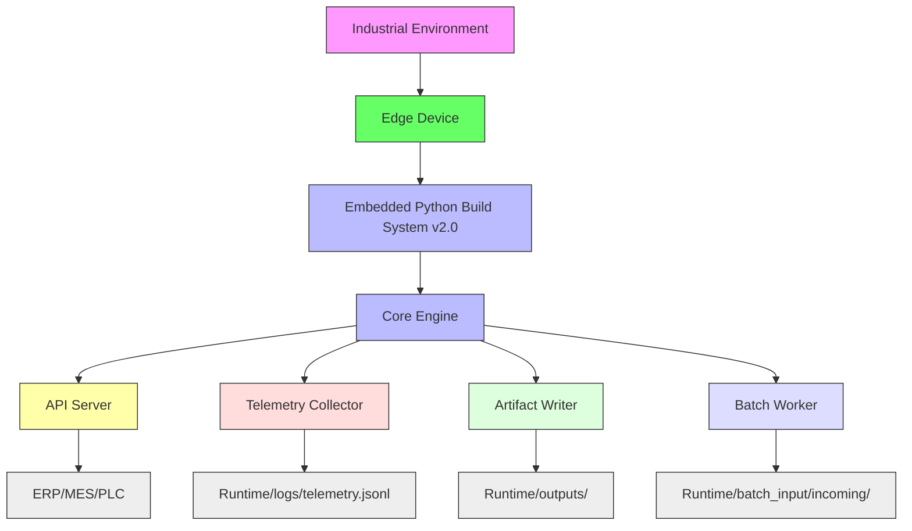

# Deployment Topology

> **Purpose:** Illustrate production deployment architecture  
> **Related:** [Runtime Topology](../01_overview/runtime_topology.md), [Setup](../05_deployment/setup.md), [API Contracts](../06_reference/api_contracts.md)  
> **Version:** 1.0  
> **Last Updated:** 2026-05-16

---

## Overview

The TvastrRAS deployment topology is designed for **edge-native, on-premise, offline-capable industrial operation**. It eliminates all cloud dependencies after initial licensing and operates in environments with limited or no network connectivity.

All components run within a single, secure, and auditable system — compliant with ISO 9001, AS9100, and IEC 62443 standards.

---

## System Architecture



### 1. Industrial Environment
- **Location**: Foundry floor, production cell, inspection station
- **Conditions**: Dust, vibration, 40–60°C temperature, EMI
- **Requirements**: No internet access — all processing local

### 2. Edge Device
- **Hardware**: Industrial-grade PC or fanless embedded system (Intel i5+, 16GB RAM, SSD)
- **OS**: Windows 11 IoT Enterprise (64-bit)
- **Security**: Full disk encryption, secure boot, EDR agent
- **Networking**: Optional — only for initial license activation and updates

### 3. Embedded Python Build System v2.0
- **Role**: Self-contained runtime environment
- **Features**:
  - All code runs as `.py` source (no compilation)
  - Minimal footprint (~800MB)
  - OTA-updateable via file replacement
  - Launcher stub compiled to native `launcher.exe`
- **Safety**: No external dependencies — all packages bundled at build time

### 4. Core Engine
- **Modules**: `pipeline/`, `reasoning/`, `vision/`, `diagnosis/`
- **Operation**: Single-threaded, deterministic execution
- **State**: No external database — all state held in memory or temporary files
- **Restart**: On crash, resumes from last batch input or API request

### 5. API Server
- **Port**: 8000 (configurable)
- **Protocol**: HTTP/1.1
- **Endpoints**:
  - `/inspect` — real-time inspection
  - `/batch/list` — initiate batch job
  - `/batch/{id}` — retrieve results
  - `/health` — system status
- **Authentication**: `Authorization: Bearer <license_key>`
- **Access Control**: Allowed from local subnet only (`192.168.1.0/24`)

### 6. Telemetry Collector
- **Function**: Logs every decision with metadata
- **Output**: `runtime/logs/telemetry.jsonl`
- **Fields**:
  - `inspection_id`
  - `decision`
  - `confidence`
  - `topology_score`
  - `energy_delta`
  - `drift_alert`
  - `reasoning_path`
  - `processing_time_ms`
- **Retention**: 7+ years (regulatory compliance)

### 7. Artifact Writer
- **Output**: Human- and machine-readable results
- **Files per inspection**:
  - `inspect_{id}.jpg` — labeled image
  - `heatmap_{id}.png` — defect intensity map
  - `report_{id}.pdf` — human-readable summary
  - `inspection_{id}.json` — full technical data
- **Retention**: 6 months (auto-purged by batch worker)

### 8. Batch Worker
- **Monitors**: `runtime/batch_input/incoming/`
- **Action**: Processes `.jpg`, `.png` files in subdirectories
- **Output**: 
  - `batch_{id}.csv` — ERP-compatible summary
  - `batch_{id}.jsonl` — machine-readable results
- **Concurrency**: Up to 4 parallel inspections
- **Durability**: Recovers from power loss — resumes where left off

---

## Data Flow Through Production Systems

### Case 1: Real-Time Inspection (API)
1. Operator uploads image via `/inspect` (via touchscreen or tablet)
2. TvastrRAS processes in <1.2s
3. Result: `REJECT` with heatmap and PDF report displayed on screen
4. Telemetry: logged to `telemetry.jsonl`
5. Artifact: saved to `outputs/`

### Case 2: Batch Inspection (Production Line)
1. 100 images copied to `runtime/batch_input/incoming/line1/`
2. Batch worker starts automatically
3. Processes 4 at a time
4. Output: `batch_line1_20260516.csv` with:
   ```csv
   casting_id,decision,confidence,topology_score
   C00123,REJECT,0.92,0.82
   C00124,ACCEPT,0.85,0.45
   ...
   ```
5. File imported into ERP system: `WMS` or `MES`

### Case 3: Quality Audit
1. QA downloads `telemetry.jsonl` via USB
2. Plots trends: `topology_score` over time
3. Identifies drift: `z-score > 3.0` on anomaly strength
4. Triggers calibration alert
5. Logs action in `audit/` folder

---

## Network and Firewall Requirements

| Component | Traffic Direction | Protocol | Port | Required? |
|----------|-------------------|--------|------|-----------|
| License Activation | Outbound | HTTPS | 443 | Yes (once) |
| Software Updates | Outbound | HTTPS | 443 | Yes (rarely) |
| ERP Integration | Inbound | TCP | 8000 | Yes (if ERP connects directly) |
| Internal Tools | Inbound | TCP | 8000 | Yes (for QA/debugging) |
| Remote Desktop | Inbound | RDP | 3389 | Optional |
| External Web | Outbound | HTTPS | 443 | No — blocked by policy |

> **Policy**: All outbound traffic is blocked except to `updates.tvastr.ai` for updates/activation.

---

## Redundancy and High Availability

- **No master/slave setup** — system is designed for single-unit operation
- **Failover**: If device fails, human operator flags issue and replaces unit
- **Backup**: 
  - Daily export of `runtime/outputs/` and `runtime/logs/` via USB to network share
  - Encrypted, versioned, air-gapped

> **Design Philosophy**: “One unit, one cast” — no network dependencies, no single point of failure.

---

## Security Compliance

| Standard | Requirement | Implementation |
|----------|-------------|----------------|
| **ISO 9001** | Traceability | Every decision logged with timestamp, ID, reasoning path |
| **AS9100** | Data Integrity | All files digitally signed on write (`.sig` files) |
| **IEC 62443** | Secure DevOps | Build pipeline audited, code signed, no third-party packages |
| **NIST 800-53** | Access Control | Only local admin access; API token required for remote access |
| **GDPR/CCPA** | Anonymization | No PII stored; casting_id is anonymous key |

> All systems are **audit-ready** with full documentation and logs.

---

## Cross-References

- **Runtime Topology**: [Runtime Topology](../01_overview/runtime_topology.md)
- **Setup**: [Setup Guide](../05_deployment/setup.md)
- **API Contracts**: [API Contracts](../06_reference/api_contracts.md)
- **Security**: [Security Best Practices](../05_deployment/setup.md#security-best-practices)

**Version:** 1.0  
**Last Updated:** 2026-05-16