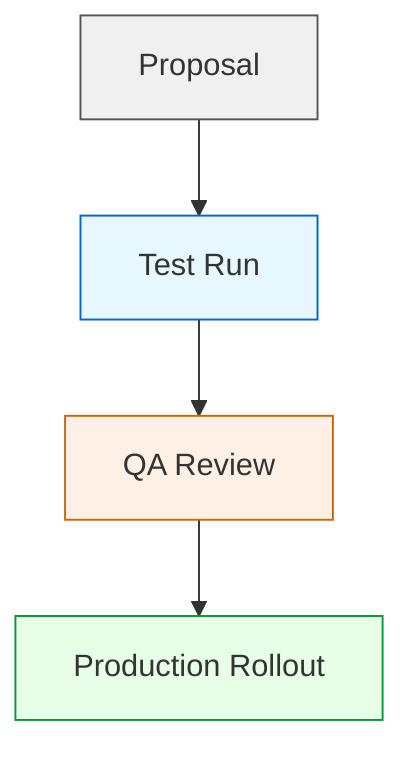

# Production Validation

> **Purpose:** Outlines production validation procedures and success criteria  
> **Related:** [Validation Restructuring](../05_deployment/validation.md), [Telemetry Runtime](telemetry_runtime.md), [API Contracts](../06_reference/api_contracts.md)  
> **Version:** 1.0  
> **Last Updated:** 2026-05-16

---

## Overview

Production validation ensures that **every system update, configuration change, or model deployment** is evaluated for safety, compliance, and performance **before** it affects live production castings.

Unlike development or QA validation, **production validation is conducted in the live environment** — using real production data, hardware, and workflows.

> **Core Principle**:  
> *“If it hasn’t been validated on real production castings under real conditions, it is not ready for production.”*

---

## Validation Lifecycle

The system enforces a **four-phase validation lifecycle**:



### Phase 1: Proposal

- **Trigger**: Change in code, config, or model
- **Owner**: Core Engine Team, QA Team
- **Output**: `validation/proposals/PROPOSAL_YYYYMMDD.md`
- **Template**:
  ```md
  # Proposal: Update LLM Reasoning Threshold
  - **State**: Proposed
  - **Lead**: Engine Team
  - **Dates**: 2026-05-10 to 2026-05-15
  - **Hypothesis**: Lowering LLM trigger from 0.8 to 0.6 improves detection of subtle defects.
  - **Success Criteria**: 
      - 5% increase in valid REJECTs
      - 0% increase in false REJECTs
      - Energy stability maintained
  - **Test Data**: Use 1,000 recent inspections from line1
  ```

### Phase 2: Test Run

- **Action**: Deploy change to **isolated production unit** (e.g., Line 3)
- **Duration**: 7–14 days
- **Inputs**:
  - Real production images
  - Full operational load
- **Outputs**:
  - `runtime/logs/telemetry.jsonl` (filtered by `metadata.change_id`)
  - `runtime/telemetry/summary.json`
  - `runtime/logs/drift_alerts.jsonl`
- **Metrics Tracked**:
  - Reject rate
  - Manual review rate
  - Energy stability
  - Drift alerts
  - Processing latency

> Change ID: `change_id: "PROP_2026-05-10"` is injected into every telemetry event.

### Phase 3: QA Review

- **Owner**: QA & Compliance Team
- **Actions**:
  1. Compare test results against **baseline** (same period last week)
  2. Verify `energy_stable: true` for >99.9% of cases
  3. Confirm no new `drift_alerts` triggered
  4. Validate semantic integrity with `semantic_audit.jsonl`
  5. Calculate **false positive/negative rate** from manual review logs

- **Decisions**:
  - ✅ **Approve**: Proceed to rollout
  - 🚫 **Reject**: Abandon change — root cause analysis
  - ⚠️ **Conditional**: Rollback to baseline and reduce scope

> **Required Deliverables**:
> - `validation/reviews/REV_YYYYMMDD.pdf` — signed report
> - `audit/validation_YYYYMMDD.md` — audit trail

### Phase 4: Production Rollout

- **Action**: Deploy change to **all units**
- **Method**:
  - Use software update system → `runtime/updates/`
  - Version bump in `VERSION.txt`
  - Automatic validation of update signature
- **Post-Rollout Monitoring**:
  - Hourly: Check `summary.json` for regressions
  - Daily: Review `telemetry.jsonl` for anomalies
- **Rollback Plan**: 
  - If issue detected, revert to last known-good version (`backup_vX.Y/`)
  - Notify QA and Engineering immediately

---

## Success Criteria

A validation is **successful** only if **all** of the following are met:

| Metric | Target | Source |
|--------|--------|--------|
| Reject Rate Change | Within ±0.5% of baseline | `summary.json` |
| Manual Review Rate | ≤ Increase of 0.1% | `summary.json` |
| Energy Stability | ≥99.9% `energy_stable: true` | `telemetry.jsonl` |
| Drift Alerts | 0 new alerts | `drift_alerts.jsonl` |
| Latency Increase | ≤15% | `summary.json` |
| Semantic Integrity | No mapping breaks | `semantic_audit.jsonl` |
| False Positive Rate | No increase | Manual review audit |
| False Negative Rate | No increase | Manual review audit |

> Any single failure → Rollback required.

---

## Validation Governance

### Who Can Initiate
- **R&D Team**: Proposes new models/behaviors
- **Core Engine Team**: Proposes config/code changes
- **QA Team**: May propose validation for known issues

### Approval Authority
- **Minor Changes** (config, weights): QA Lead
- **Major Changes** (model, LLM, reasoning): QA Lead + Engineering Director + Compliance Officer

### Documentation Requirements
Every validation must leave a complete audit trail:

```text
docs/
├── validation/
│   ├── proposals/
│   │   └── PROPOSAL_20260510.md
│   ├── reviews/
│   │   └── REV_20260515.pdf
│   └── audit/
│       └── validation_20260515.md
└── docs/audit/
    └── validation_20260515.md
```

> File must include:
> - Approver signatures (digital or scanned)
> - Start/end dates
> - Test environment details (hardware, software version, production line)
> - All metrics and decision rationale

---

## Cross-References

- **Validation Restructuring**: [Validation Restructuring](../05_deployment/validation.md)
- **Telemetry Runtime**: [Telemetry Runtime](telemetry_runtime.md)
- **API Contracts**: [API Contracts](../06_reference/api_contracts.md)
- **Audit Consolidation**: [Audit Consolidation](../04_configuration/config_guide.md)

**Version:** 1.0  
**Last Updated:** 2026-05-16